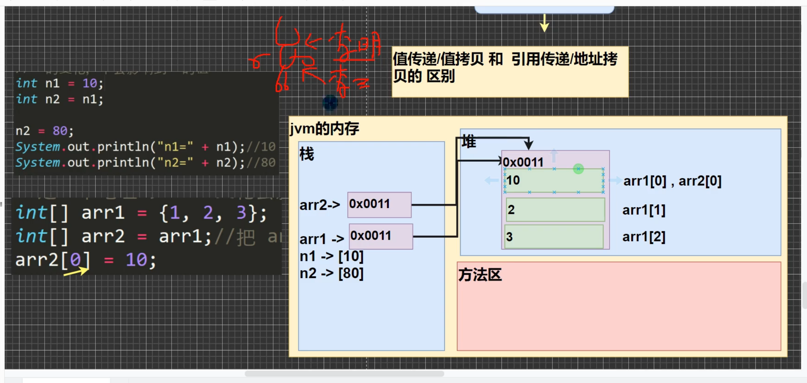
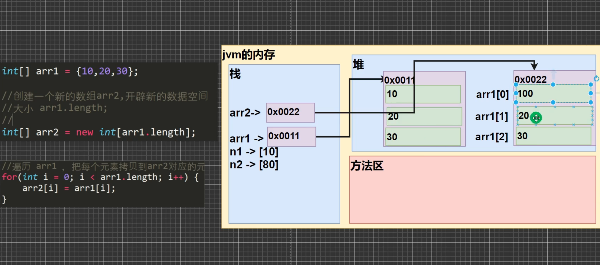
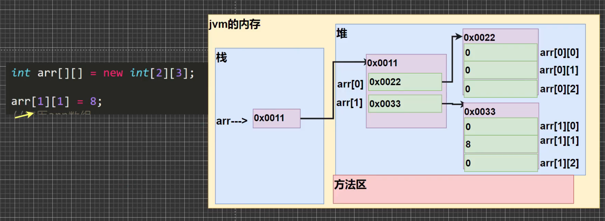

# 数组、排序和查找

## 数组

### 定义

1. 数组可以存放多个同一类型的数据。数组也是一种数据类型，是引用数据类型。

```java
// 静态初始化
double[] array1= {1, 2, 3};

// 动态初始化
double[] array1= new double[6];

//
double[] array2;
array2 = new double[7];
```

### 使用注意事项和细节

1. 数组是多个相同类型的数据的组合，实现对这些数据的统一管理。

2. 数组中的元素可以是任何数据类型，包括基本数据类型和引用数据类型，但是不能混用。

3. 数组创建后，如果没有赋值，有默认值。

4. 使用数组的步骤
   - 声明数组并开辟空间
   - 给数组各个元素赋值
   - 使用数组

5. 数组的下标是从0开始的

6. 数组下标必须在指定范围内使用，否则ArrayIndexOutofBoundsException

7. 数组属于引用数据类型，数组型数据是对象。

### 数组赋值机制

#### 基本数据类型赋值，赋值方式为值拷贝

####  数组在默认情况下是引用传递, 赋的值是地址

```java
// 简单拷贝
int[] array1 = new int[5];
int[] array2 = array1;
```



#### 深浅拷贝

##### 自我理解:浅拷贝只是简单的地址拷贝, 深拷贝是类似数组拷贝的全拷贝

```java
//
int[] array1 = new int[5];
// 开辟一个新的空间
int[] array2 = new int[5];

// 每个元素都拷贝到array2对应的位置元素
for (int i = 0; i < array1.length; i++) {
    array2[i] = array1[i];
}
```



## 排序

### 排序的分类

#### 内部排序

   - 指将需要处理的所有数据都加载到内存存储器中进行排序，包括(交换式排序法、选择式排序法和插入式排序法)

#### 外部排序

   - 数据量过大，无法全部加载到内存中，需要借助外部数据存储，进行排序(包括合并排序和直接合并排序法)

#### 冒泡排序

   - 通过对待排序序列从后向前(从下标较大的元素开始), 依次比较相邻元素的值，若发现逆序则交换，使值较大的元素逐渐从前移向后部。

## 查找

### 顺序查找

### 二分查找

## 二维数组 TwoDimensionalArray

### 静态初始化

```java
int[][] arr = {{0, 0, 0, 0, 0, 0}, {0, 0, 1, 0, 0, 0}, {0, 2, 0, 3, 0, 0}, {0, 0, 0, 0, 0, 0}};
```

### 动态初始化

```java
int[][] arr2 = new int[2][3];
```


