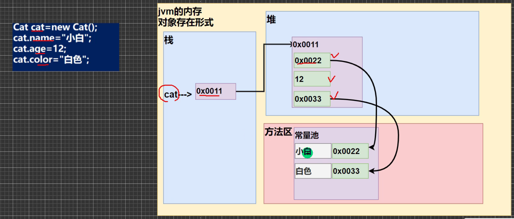
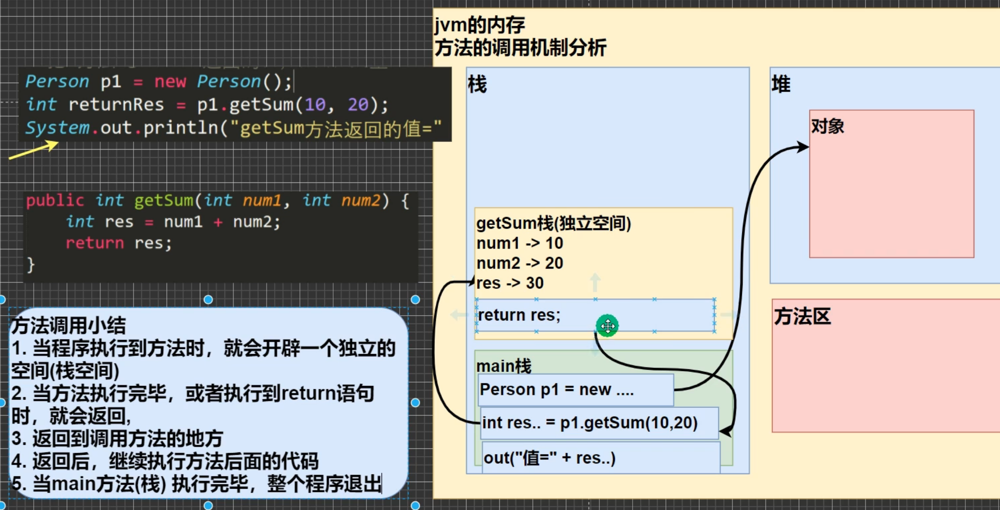
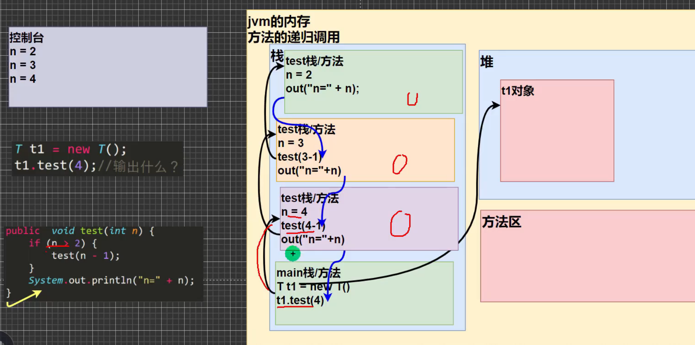
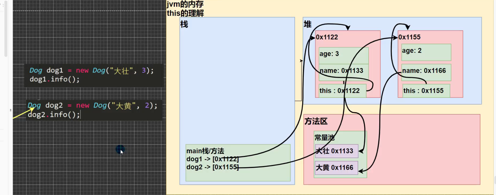
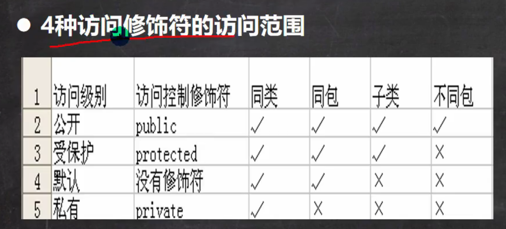
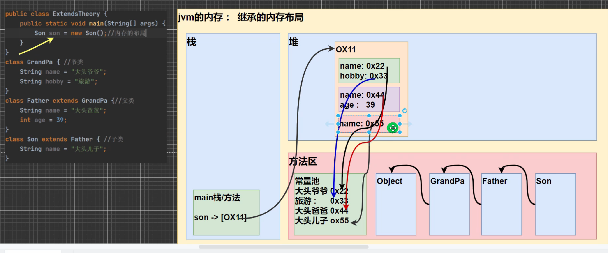
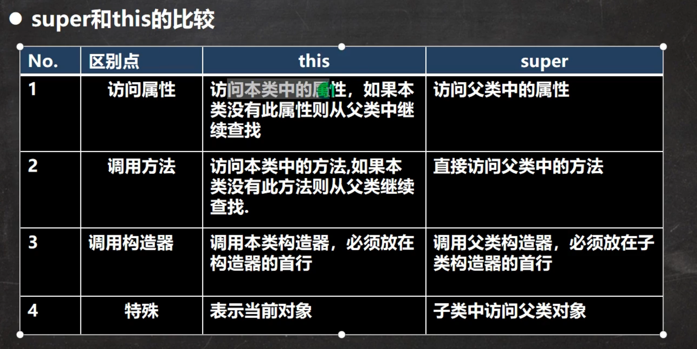
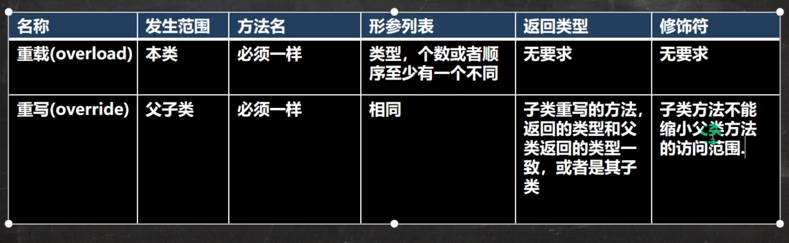
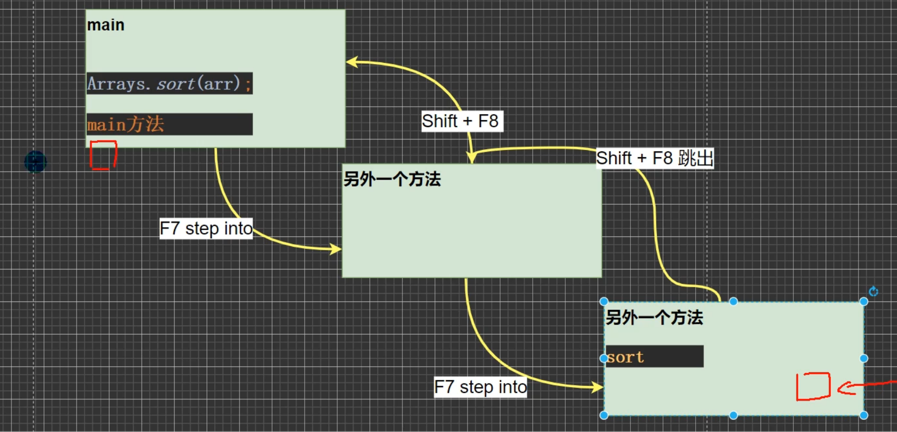

# 面向对象

## 类与对象

1. 类是抽象的，概念的，代表一类事物。

2. 对象是具体的，实际的，代表一个具体事物。

3. 类是对象的模板，对象是类的一个个体。



### 基本介绍

1. 从概念或叫法上看: 成员变量 = 属性 = field (即 成员变量是用来表示属性的，授课中，统一叫属性);

2. 属性是类的一个组成部分,一般是基本数据类型，也可以是引用类型(对象、数组);

### 属性的细节

1. 属性的定义语法同变量, 示例：访问修饰符 属性类型 属性名

2. 属性的定义类型可以为任意类型，包含基本类型或引用类型

3. 属性如果不赋值，有默认值，规则和数组一致

### 类和对象的内存分析

1. 栈: 一般存放基本数据类型(局部变量)

2. 堆: 存放对象

3. 方法区: 常量池(常量, 比如字符串), 类加载信息

#### 简单流程

> 1. 先加载Person类信息(属性和方法信息，只会加载一次)
> 
> 2. 在堆中分配空间，进行默认初始化(看规则)
> 
> 3. 在地址赋给p, p就指向对象
> 
> 4. 进行指定初始化,比如p.name = "jack" 

### 成员方法



#### 成员方法的好处

1. 提高代码的复用性

2. 可以将实现的细节封装起来,然后供其他用户来调用即可

#### 成员方法的定义

```java
访问修饰符 返回数据类型 方法名 (参数列表) {
    语句;
    return 返回值;
}
```

1. 参数列表: 表示成员方法输入

2. 数据类型(返回类型) : 表示成员方法输出，void 表示没有返回值;

3. 方法主体: 表示为了实现某一功能代码块

4. return语句不是必须的

#### 成员方法细节

##### 访问修饰符

> public, proteced, default, private

##### 返回数据类型
> 1. 一个方法最多有一个返回值
> 
> 2. 返回类型可以为任意类型, 包含基本类型或引用类型(数组, 对象)
> 
> 3. 如果方法要求有返回数据类型, 则方法体中最后的执行语句必须return值，而且要求返回值类型必须和return的值类型一致或兼容
> 
> 4. 如果方法是void, 则方法体中可以没有return语句

##### 方法名

> 遵循驼峰命名法(见名知意);

##### 参数列表

> 1. 一个方法可以有0个参数，也可以有多个参数，中间用逗号隔开
>
> 2. 参数类型可以为任意类型, 包含基本数据类型和引用数据类型
>
> 3. 调用带参数的方法时,一定对应着参数列表传入相同类型或兼容类型的参数
>
> 4. 方法定义时的参数称为形式参数, 简称形参; 方法调用时的参数称为实际参数, 简称实参,实参和形参的类型要一致或兼容、个数、顺序必须一致！！！

##### 方法体

> 里面写完成功能的具体的语句，可以为输入、输出、变量、运算、分支、循环、方法调用、但不能嵌套方法

#### 方法调用细节

> 1. 在同一个类中的方法调用: 直接调用即可。
>
> 2. 跨类中的方法A类调用B类方法

#### 方法传参机制

## 方法递归调用

### 介绍

> 递归就是方法自己调用自己,每次调用时传入不同的变量。递归有助于编程者解决复杂问题，同时可以让代码变得简洁。



### 递归方法调用规则

1. 执行一个方法时，就创建一个新的受保护的独立空间(栈空间)

2. 方法的局部变量是独立的，不会相互影响，比如n变量

3. 如果方法中使用的是引用数据类型(比如数组), 就会共享该引用数据类型

4. 递归必须向退出递归的条件逼近，否则就是无限递归出现(StackOverFlowError)

5. 当一个方法执行完毕，或者遇到return，就会返回，遵守方法调研，就当结果返回给谁，同时当方法执行完毕或者返回时，该方法就执行完毕。

## 方法重载

### 基本介绍
> java中允许同一个类中，多个同名方法的存在，但要求型参列表不一致

### 好处

1. 减轻了起名的麻烦

2. 减轻了记名的麻烦

### 注意事项

1. 方法名：必须相同

2. 形参列表: 必须不同(形参类型或个数或顺序，至少有一个不同，参数名无要求)

3. 返回类型: 无要求

## 可变参数

### 基本概念

java允许将同一个类中多个同名同功能但参数个数不同的方法，封装成一个方法。

### 基本语法

```java
访问修饰符 返回类型 方法名(数据类型... 形参名) {

}
```

### 注意事项

1. 可变参数的实参可以为0个或任意多个

2. 可变参数的实参可以为数组

3. 可变参数的本质就是数组

4. 可变参数可以和普通类型的参数一起放在形参列表，但必须保证可变参数在最后

5. 一个形参列表中只能出现一个可变参数

## 作用域

### 定义

1. 在java编程中，主要的变量就是属性(成员方法)和局部变量

2. 局部变量一般是指在成员方法中定义的变量。

3. java中作用域的分类
   - 全局变量: 也就是属性，作用域为整个类体Cat类: cry eat 等方法使用属性
   - 局部变量: 也就是除了属性之外的其他变量，作用域为定义他的代码快中

4. 全局变量可以不赋值，直接使用，因为有默认值，局部变量必须赋值后，才能使用，因为没有默认值。

###  注意事项

1. 属性和局部变量可以重名，访问时遵循就近原则

2. 在同一个作用域中，比如在同一个成员方法中，两个局部变量; 不能重名

3. 属性生命周期较长，伴随着对象的创建而创建，伴随着对象的销毁而销毁。局部变量，在生命周期较短，伴随着它的代码块的执行而创建(伴随着代码块的结束而销毁.即在一次方法调用过程中);

4. 作用域不同
   - 全局变量: 可以在本类使用，或其他类使用
   - 局部变量: 只能在本类中对应的方法中使用

5. 修饰符不同
   - 全局变量/属性可以加修饰符
   - 局部变量不可以加修饰符

## 构造方法/构造器

```java
修饰符 方法名(形参列表) {
    方法体;
}
```

1. 构造器的修饰符可以默认

2. 构造器没有返回值

3. 方法名和类名字必须一样

4. 参数列表和成员方法一样的规则

5. 构造器的调用, 由系统完成

### 介绍

构造方法又叫构造器, 是类的一种特殊的方法，他的主要作用是完成对新对象的初始化。

### 特点

1. 方法名和类名相同

2. 没有返回值

3. 在创建对象时，系统会自动的调用该类的构造器完成对对象的初始化

### 注意事项

1. 一个类可以定义多个不同的构造器，即构造器重载

2. 构造器名和类名要相同

3. 构造器没有返回值

4. 构造器是完成对象的初始化，并不是创建对象

5. 在创建对象时，系统自动的调用该类的构造方法

6. 如果从没有定义构造方法，系统会自动给类生成一个默认构造方法(默认构造方法);

7. 一旦定义了自己的构造器，默认的构造器就覆盖了，就不能使用默认的无参构造器。

## this关键字

### 定义

> java虚拟机会给每个对象分配this,代表当前对象
>
> 哪个对象调用，this就代表哪个对象 




### 使用事项
1. this关键字可以用来访问本类的属性、方法、构造器

2. this用于区分当前类的属性和局部变量

3. 访问成员方法的语法：this.方法名(参数列表)

4. 访问构造器语法：this(参数列表); 只能在构造器中使用,且必须是第一条语句。

5. this不能在类定义的外部使用，只能在类定义的方法中使用。

## 包

### 包的作用

1. 区分相同名字的类

2. 当类很多时，可以很好的管理类

3. 控制访问范围

### 语法

```java
package com;
```

### 包的本质分析

1. 实际是创建不同的文件夹来保存类文件

### 包的命名

> 只能包含数字、字母、下划线、小圆点，但不能用数字开头，不能是关键字或保留字

### 常用包

> java.lang.* 默认引用
>
> java.util.* util包，系统提供的工具包，工具类
>
> java.net.* 网络包，网络开发
>
> java.awt.* 做java的界面开发, GUI

### 注意事项

1. package 的作用是声明当前类所在的包，需要放在类的最上面，一个类中最多只有一局package

2. import 指令位置放在package的下面，在类定义前面，可以有多局且没有顺序要求

## 访问修饰符

> 公开级别: 用public修饰，对外公开
>
> 受保护级别：用protected修饰，对子类和同一个包中的类公开
>
> 默认级别：没有修饰符号，向同一个包的类公开
>
> 私有级别：用private修饰，只有类本身可以访问，不对外公开

### 访问范围



### 使用注意事项

1. 修饰符可以用来修饰类中的属性，成员方法以及类

2. 只有默认的和public才能修饰类！ 并且遵循上述访问权限的特点。

3. ...

4. 成员方法的访问规则和属性完全一样

## 三大特征

### 封装

#### 定义

> 把抽象出的数据和对数据的操作封装在一起，数据被保护在内部，程序的其他部分只有通过被授权的操作才能对数据进行操作

#### 好处

1. 隐藏实现细节

2. 对数据进行验证，保证安全合理

### 继承

#### 介绍

> 继承可以解决代码复用，让我们的编程更加接近人类思维，当多个类存在相同的属性(变量)和方法时，可以从这些类中抽象出父类，在父类中定义这些相同的属性和方法，所有的子类不能重新定义这些属性和方法，只需要通过extends来声明父类即可

#### 语法

```java
class 子类 extends 父类 {
}
```

1. 子类自动拥有了父类定义的属性和方法

2. 父类又叫超类、基类

3. 子类又叫派生类

#### 好处

1. 代码的复用性提高

2. 代码的扩展性和维护性提高了

#### 注意事项

> 1. 子类继承了所有的属性和方法，但是私有属性和方法不能在子类直接访问，要通过公共的方法去访问
> 
> 2. 子类必须调用父类的构造器，完成父类的初始化。 默认调用super();
> 
> 3. 当创建子类对象时，不管使用子类的那个构造器，默认情况下总会去调用父类的无参构造器，如果父类没有提供无参构造器，则必须在子类的构造器中用super去指定使用父类的那个构造器完成对父类的初始化工作，否则，编译不能通过
> 
> 4. 如果希望指定去调用父类的某个构造器，则显式的调用以下：super()
> 
> 5. super在使用时，需要放在构造器第一行
> 
> 6. super() 和 this() 都只能放在构造器第一行，因此这两个方法不能共存在一个构造器中
> 
> 7. java所有类都是Object的子类，Object是所有类的基类
> 
> 8. 父类构造器的调用不限于直接父类！将一致往上追溯到Object(顶级父类)
> 
> 9. 子类最多只能继承一个父类(指直接继承), 即java中是单继承机制
> 
> 10. 不能滥用继承，子类和父类必须满足is-a的逻辑关系

#### 继承的本质



## super

### 基本介绍

> super 代表父类的引用,用于访问父类的属性、方法、构造器

### 基本语法

> 1. 访问父类的属性，但不能访问父类的private属性
>   super.属性名
> 2. 访问父类的方法，不能访问父类的private方法
> super.方法名
> 3. 访问父类的构造器:
> super(); \// 只能放在构造器的第一句,只能出现一句

### 注意事项

1. 调用父类的构造器的好处(分工明确，父类属性由父类初始化，子类的属性是由于子类初始化)

2. 当子类中有和父类中的成员(属性和方法)重名时， 为了访问父类的成员，必须通过supder. 如果没有重名，使用super、this、直接访问时一样的效果

3. super的访问不限于直接父类，如果爷爷类和本类中有同名的成员，也可以使用super去访问爷爷类的成员；如果多个基类(上级类)中都有同名的成员，使用super访问遵循就近原则

### super和this的区别



## 重写(override)

### 基本介绍

> 方法重写就是子类有一个方法和父类的某个方法的名称、返回值类型、参数均相同,则称子类重写了父类的方法

### 注意事项

1. 子类的方法的参数、方法名称，要和父类方法的参数、方法名称完全一样

2. 子类方法的返回类型和父类方法返回类型一样，或者是父类返回类型的子类

3. 子类方法不能缩小父类方法的访问权限

### 重写和重载的区别



## 多态 (polymorphic)

### 基本介绍

> 方法或对象具有多种形态。是面向对象的三大特征，多态是建立在封装和继承基础之上的

### 多态的体现

1. 方法的多态
   - 重写和重载就体现了多态

2. 对象的多态

   - 一个对象的编译类型和运行类型可以不一致

   - 编译类型在定义对象时，就确定了，不能改变

   - 运行类型是可以变化的

   - 编译类型看定义时 = 号的左边， 运行类型看 = 号的右边

### 多态的注意事项

#### 前提

> 两个对象存在继承关系

#### 本质

> 父类引用指向子类对象

#### 语法

> 父类类型 名称 = new 子类类型();

#### 特点

> 编译看左, 运行看右
> 
> 不能调用父类中的所有成员
>
> 不能调用子类中特有成员
>
> 最终运行效果看子类的具体实现

#### 向下转型

1. 子类类型 引用名 = (子类类型) 父类引用；

2. 只能强转父类的引用,不能强转父类的对象

3. 要求父类的引用必须指向的是当前目标类型的对象

4. 向下转型后,可以调用子类类型中的所有成员

> 属性没有重写之说，属性的值看**编译类型**

> instanceOf比较操作符，用于判断对象的**运行类型**是否为XX类型或XX类型的子类类型

### 多态的应用

1. 多态数组
   - 数组的定义类型为父类类型，里面保存的实际元素类型为子类类型

2. 多态参数
   - 方法定义的形参为父类类型，实参类型允许为子类类型

## java的动态绑定机制

> 1. 当调用对象方法的时候，该方法会和该对象的内存地址/运行类型绑定
>
> 2. 当调用对象属性时，没有动态绑定机制，哪里声明，哪里使用。

## Object类详解

### equals方法

> == 和 equals的对比

1. == : 即可以判断基本类型，又可以判断引用类型

2. == ：如果判断基本类型，判断的是值是否相等。

3. == ：如果判断引用数据类型，判断的是地址是否相等，即判断是不是同一个对象

4. equals ：是Object类中的方法，只能判断引用数据类型

5. 默认判断的是地址是否相等，子类中往往重写该方法，用于判断内容是否相等

### hashCode方法

1. 提高具有哈希结构的容器的效率

2. 两个引用，如果指向的是同一个对象，则哈希值肯定是一样的

3. 两个引用，如果指向的是不同对象，则哈希值是不一样的

4. 哈希值主要根据地址号来的！不能完全将哈希值等价于地址

### toString方法

#### 基本介绍

> 默认返回：全类名 + @ + 哈希值的十六进制,子类往往重写toString方法，用于返回对象的属性信息
> 
> 重写toString方法，打印对象或拼接对象时，都会调用该对象的toString形式
> 
> 当直接输出一个对象时，toString方法会被默认的调用

### finalize方法

1. 当对象被回收时，系统自动调研该对象的finalize方法。子类可以重写该方法，做一些释放资源的操作

2. 什么时候被回收: 当某个对象没有任何引用时，则jvm就认为对象时一个垃圾对象，就会使用垃圾回收机制来销毁对象，在销毁该对象前，会先调用finalize方法。

3. 垃圾回收机制的调用，是由系统来决定的，也可以通过System.gc()主动触发垃圾回收机制

## Debug


