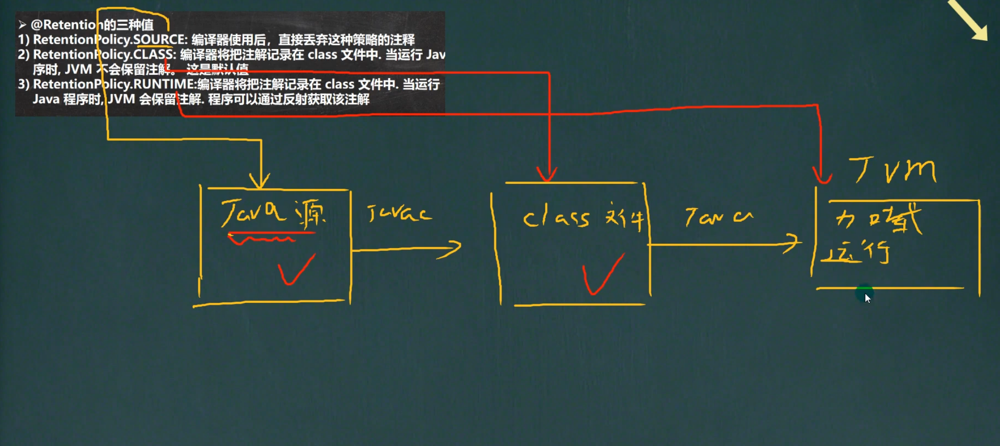

# 枚举

> 枚举是一组常量的集合。

> 枚举属于一种特殊的类，里面只包含一组特定有限的特定的对象

## 自定义枚举类

1. 不需要提供setXXX方法，因为枚举对象值通常为只读

2. 对枚举对象/属性使用final + static共同修饰，实现底层优化

3. 枚举对象名通常使用全部大写，常用的命名规范

4. 枚举对象根据需要，也可以有多个属性

## 注意事项

1. 当我们使用enum关键字开发一个枚举类，默认会继承Enum类

2. 传统的public static findal Season SPRING = new Season("Spring"); 简化成SPRING("Spring");

3. 如果使用无参构造器创建枚举对象，则实参类表和小括号都可以省略

4. 当有多个枚举对象时，使用，间隔，最后一个用分号结尾

5. 枚举对象必须放在枚举类的行首

## 小结

1. 使用enum关键字后，就不能继承其他类了，因为enum会隐式继承Enum，而Java是单继承机制

2. 枚举类和普通类一样，可以实现接口，

```java
enum Name implements interface1, interface2 {}
```

# 注解

## 注解的理解

1. 注解也被称为元数据，用于修饰解释 包、类、方法、属性、构造器、局部变量等数据信息

2. 和注释一样，注解不影响程序逻辑，但注解可以被编译或运行，相当于嵌入在代码中的补充信息

3. 在javase中，注解的使用目的比较简单，例如标记过时的功能，忽略警告等，在javaEE中注解占据了重要的角色，例如配置应用程序的任何切面，代替javaEE旧版中所遗留的冗余代码和XML配置

## 基本的Annotation介绍

> 使用Annotation时要在其前面增加@符号，并把该Annotation当成一个修饰符使用，用于修饰它支持的程序元素

### @Override

> 用于限定某个方法是重写父类方法，该注解只能用于方法

1. 表示重写父类方法，如果父类没有该方法，则会报错

2. 如果不写@Override注解，也没有问题

3. @Override只能修饰方法，不能修饰其他类，包，属性等@Target(ElementType.METHOD)

4. @Target 是修饰注解的注解，称为元注解

### @Deprecated

1. 用于表示某个程序元素已经过时

2. 用于修饰方法，类，字段，包，参数等

3. 做到新旧版本的兼容过时

> 用于表示某个程序元素已过时

### @SuppressWarnings

> 抑制编译器警告

## 元注解

### 基本的介绍

> 用于修饰其他注解的注解

### 种类

### Retention

> 用于指定Annotation可以保留多长时间，包含一个RetentionPolicy类型的成员变量，使用时必须为value成员变量指定值

1. RetentionPolicy.SOURCE
   - 编译器使用后，直接丢弃这种策略的注释

2. RetentionPolicy.CLASS
   - 编辑器将吧注释记录在class文件中，当运行java程序时，JVM不会保留注解。这是默认值

3. RetentionPolicy.RUNTIME
   - 编辑器将吧注释记录在class文件，当运行java程序时，JVM会保留注解。程序可以通过反射获取该注解。

2. Target :指定注解可以在那些地方使用

3. Documented : 指定可否在javadoc体现

4. Inherited： 子类会继承父类


