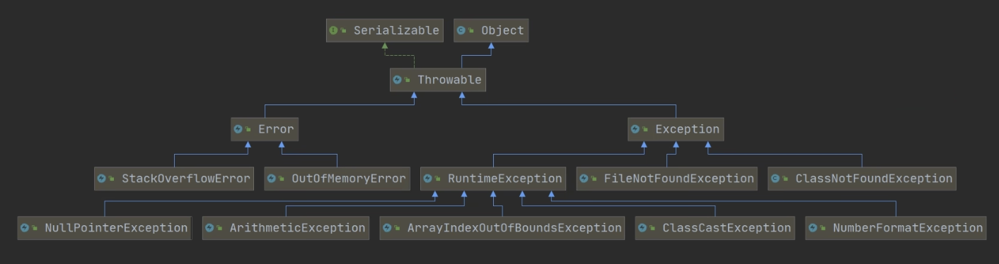
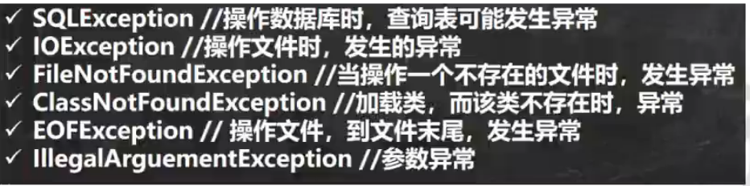
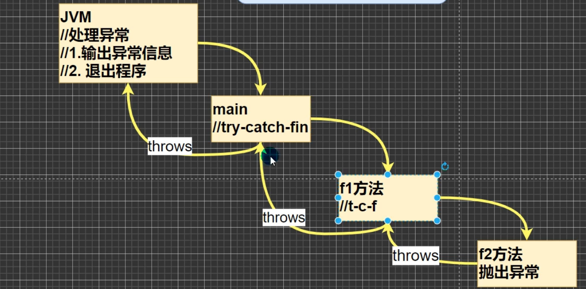
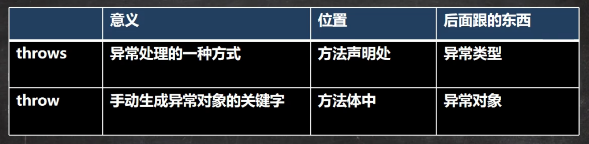

# 异常的概念

> java语言中，将程序执行中发生的不正常情况称为"异常"。

1. Error(错误): java虚拟机无法解决的严重问题。如：JVM系统内部错误、资源耗尽等严重情况。比如: StackOverflowError[栈溢出]和OOM(out of memory), Error是严重错误，程序会崩溃。

2. Exception: 其他因编程错误或偶然的外在因素导致的一般性问题，可以使用针对性的代码进行处理。例如空指针访问，试图读取内存不存在的文件，网络连接中断等等，Exception分为两大类：运行时异常和编译时异常。

# 异常体系图



## 小结

1. 异常分为两大类，运行时异常和编译时异常

2. 运行时异常，编译器不要求强制处置的异常。一般是指编程时的逻辑错误，是程序员应该避免其出现的异常。java.lang.RuntimeException类及它的字类都是运行时异常

3. 对于运行时异常，可以不做处理，因为这类异常很普遍，若全处理可能对程序的可读性和运行效率产生影响。

4. 编译时异常， 是编译器要求必须处置的异常。

# 常见的异常

## NullPointerException 空指针异常

> 当应用程序时图在需要对象的地方使用null时，抛出异常

## ArithmeticException 数学运算异常

## ArrayIndexOutOfBoundsException 数组下标越界异常

## ClassCastException 类型转换异常

## NumberFormatException 数字格式不正确异常



# 异常处理概念

## 基本介绍

> 异常处理就是当异常发生时，对异常处理的方式。

# 异常处理分类

## try-catch-finally

```java
try {
    // 1. 当异常发生时
    // 2. 系统将异常封装成Exception对象e，传递给catch
} catch () {
    // 3. 得到异常对象后，程序员自己处理
    // 4. 如果没有发生异常catch代码块不执行
} finally {
    // 1. 不管try代码块是否发生异常，始终要执行 finally
    // 2. 通常将释放资源的代码，放在finally
}
```

1. 如果异常发生了，则异常发生后面的代码不会执行，直接进入到catch块

2. 如果异常没有发生，则顺序执行try的代码块，不会进入到catch

3. 如果希望不管是否发生异常，都执行某段段代码(比如关闭连接，释放资源等)

4. 可以有多个catch语句，捕获不同的异常(进行不同的业务处理)，要求父类异常在后，子类异常在前，如果发生异常，只会匹配一个catch

5. 可以进行try-finally配合使用，这种用法相当于没有捕获异常，因此程序会直接崩溃/退出

## throws

1. 如果一个方法(中的语句执行时)可能生成某种异常，但是并不能确定如何处理这种异常，则此方法应显示地声明抛出异常，表明该方法将不对这些异常进行处理，而由该方法的调用者负责处理

2. 在方法声明中用throws语句可以声明抛出异常的列表，throws后面的异常类型可以时方法中产生的异常类型，也可以是它的父类

```java
throws
```

### 注意事项

1. 对于编译异常，程序必须处理

2. 对于运行时异常，程序中如果没有处理，默认就是throws的方式处理

3. 子类重写父类的方法时，对抛出异常的规定：子类重写的方法，所抛出的异常类型要么和父类抛出的异常一致，要么为父类抛出的异常的类型的子类型。

4. 在throws过程中，如果有方法try-catch，就相当于处理异常，就不必throws



# 自定义异常

## 基本概念

> 当程序中出现了某些"错误"， 但该错误信息并没有在Throwable子类中描述处理，这个时候可以自己设计异常类，用于描述该错误信息

## 步骤

1. 定义类：自定义异常类名继承Exception或RuntimeException

2. 如果继承Exception, 属于编译异常

3. 如果继承RuntimeException，属于运行异常

##

1. 常常继承RuntimeException，可以使用默认的处理机制

# throw和throws的对比


