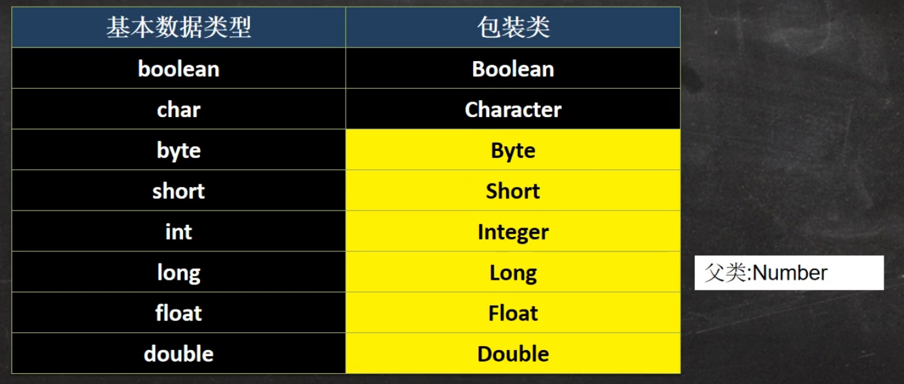
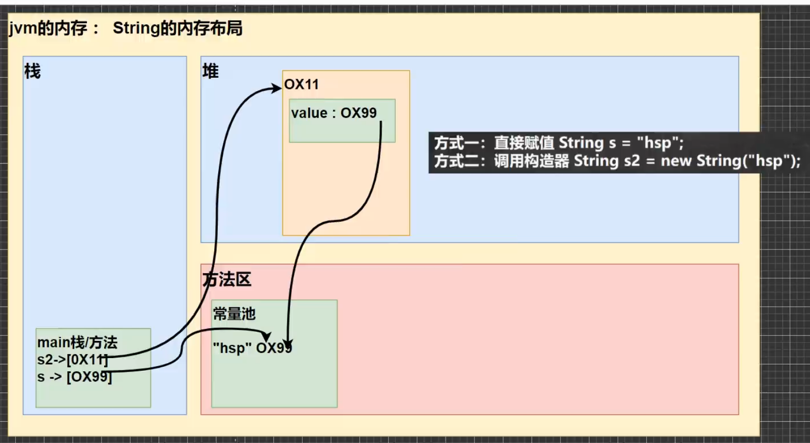
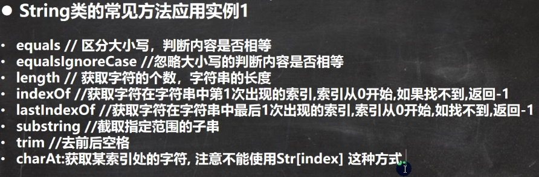
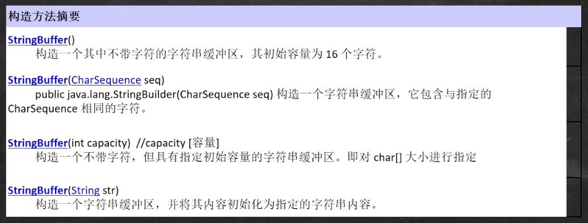
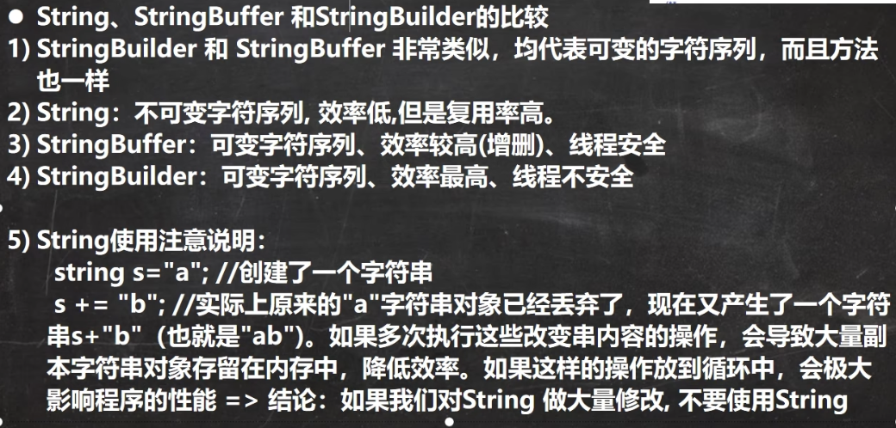

# 包装类



## 包装类和基本数据的转换

1. jdk5 前的手动装箱和拆箱方式，装箱：基本类型-> 包装类型，反之，拆箱

2. jdk5 以后的自动装箱和拆箱方式

3. 自动装箱底层调用的是valueOf方法

### 包装类转Stringss

```java
Integer i = 1;
// 1.
i + "";

// 2.
i.toString();

// 3.
String.valueOf(i);
```

### String转包装类

```java
String str = "";
Integer i1 = Integer.parseInt(str);
Integer i2 = new Integer(str);
```

### Integer面试总结

```java
// 范围 -128～127返回的为cache数组的值,否则返回的是new的Integer的对象
if (i >= IntegerCache.low && i <= IntegerCache.high)
    return IntegerCache.cache[i + (-IntegerCache.low)];
    return new Integer(i);
```

> 只要有基本数据类型，判断的就是值是否相同

# String类

## String类的理解和创建对象

1. String对象用于保存字符串，也就是一组字符序列

2. 字符串常量对象是用双引号括起来的字符序列。

3. 字符串的字符使用Unicode字符编码，一个字符(不区分字母还是汉字)，占两个字节

4. String类较常用构造方法：

```java
String s1 = new String();
String s2 = new String(String original);
String s3 = new String(char[] a);
String s4 = new String(char[] a, int startIndex, int count);
```

5. String是final的,不可以继承,重写

6. String实现Serializable接口，可以进行网络传输

7. String实现Comparable接口,可以进行比较

8. 底层是使用private final char value[];  The value is used for character storage.

## 创建String的两种方式。

1. String s = "asdfa";

   - 先从常量池查看是否有"asdfa"数据空间，如果有，直接指向；如果没有则重新创建，然后指向。S最终指向的是常量池的空间地址.

2. String s = new String("asdfa");

   - 先从堆中创建空间，里面维护了value属性，指向常量池的asdfa空间。如果常量池没有，重新创建，如果有，直接通过value指向。最终指向的是堆中的空间地址

## String内存布局



```java
When the intern method is invoked, if the pool already contains a
string equal to this {@code String} object as determined by
the {@link #equals(Object)} method, then the string from the pool is
returned. Otherwise, this {@code String} object is added to the
pool and a reference to this {@code String} object is returned.

new String().intern(); return the pool of string address;
```

```java
public class Test1 {
    String str = new String("hsp");
    final char[] ch = {'j', 'a', 'v', 'a'};

    public void change(String str, char ch[]) {
        str = "java";
        ch[0] = 'h';
    }

    public static void main(String[] args) {
        Test1 ex = new Test1();
        ex.change(ex.str, ex.ch);
        System.out.print(ex.str + " and ");
        System.out.print(ex.ch); // shp and hava
    }
}

```

## String的常用方法

> String类是保存字符串常量的，每次更新都需要重新开辟空间，效率低，因此提供了StringBuilder和StringBuffer来增强String的功能，并提高效率



# StringBuffer和StringBuilder类

## StringBuffer类

1. java.lang.StringBuffer代表可变的字符序列，可以对字符串内容进行增删

2. 很多方法与String相同，但是StringBuffer是可变长度的

3. StringBuffer是一个容器

## String VS StringBuffer

1. String保存的是字符串常量，里面的值不能更改，每次String类的更新实际上就是更改地址，效率较低 \//private final char[] value;

2. StringBuffer保存的是字符串常量，里面的值可以更改，每次StringBuffer的更新实际上可以更新内容，不用更新地址，效率更高。 \//char[] value;

## StringBuffer的构造器



## String和StringBuffer相互转换

```java
// StringBuffer ---> String
String s = "hello";

// 1. 
StringBuffer b1 = new StringBuffer(s);

// 2.
StringBuffer b2 = new StringBuffer();
b2.append(s);

// String ---> StringBuffer

// 1.

String s2 = b1.toString();

String s3 = new String(b1);

```

## StringBuilder类

1. 一个可变的字符序列。此类提供一个与StringBuffer兼容的API，但不保证同步。该类呗设计用作StringBuffer的一个简易替换。**用在字符串缓冲区被单个线程使用的时候**，如果可能，建议优先采用该类，因为在大多数实现中，它比StringBuffer要快。

2. 在StringBuilder上的主要操作时append和insert方法，可重载这些方法，以接受任意类型的数据。



## 使用结论

1. 如果字符串存在大量的修改操作，一般使用StringBuffer或Stringbuilder

2. 如果字符串存在大料的修改操作，并在单线程的情况下，使用StringBuilder

3. 如果字符串存在大料的修改操作，并在多线程的情况下，使用StringBuffer

4. 如果我们字符串很少修改，被多个对象引用，使用String，比如配置信息等

# Math类

```java
int num = (int) (Math.random() * (b - a + 1) + a);
```

# System类

1. exit

2. arraycopy

3. currentTimeMillens: 返回当前时间距离1970-1-1的毫秒数

4. gc运行垃圾回收机制System.gc()

# Arrays类

> 用于管理或操作数组(比如排序和搜索)

1. toString 返回数组的字符串形式
   - Arrays.toString(arr);

2. sort排序(自然排序和定制排序) Integer arr[] = {1, -1, 7, 0, 89};

3. binarySearch 通过二分搜索法进行查找，要求必须排好序

```java
int index = Arrays.binarySearch(arr, 3);
```

# BigInteger和BigDecimal类

1. BigInteger适合保存比较大的整型

2. BigDecimal适合保存精度更高的浮点型

   - divide可能会抛出ArithmeticException, 限定精度可以解决

```java
BigDecimal bigDecimal = new BigDecimal("1999.1324321512343513412353124151234")
BigDecimal bigDecimal = new BigDecimal("2")
bigDecimal.divide(bigDecimal2, BigDecimal.ROUND_CEILING);
```

# Date日期类、Calendar日历类以及新的日期

## Date and SimpleDateFormat

## Calendar存在的问题

1. 可变性: 像日期和时间这样的类应该是不可变的

2. 偏移性：Date中的年份是从1900开始的，而月份都是从0开始的。

3. 格式化：格式化只对Date有用，Calendar则不行

4. 他们不是线程安全的，不能处理闰秒 (每隔2天，多出一秒)

## LocalDate LocatTime LocalDateTime

1. LocalDate 只包含日期(年月日)

2. LocalTime 只包含时间,可以获取时间字段(时分秒)

3. LocalDateTime 包含日期+时间,可以获取时间字段(年月日时分秒)

## DataTimeFormatter格式日期类


