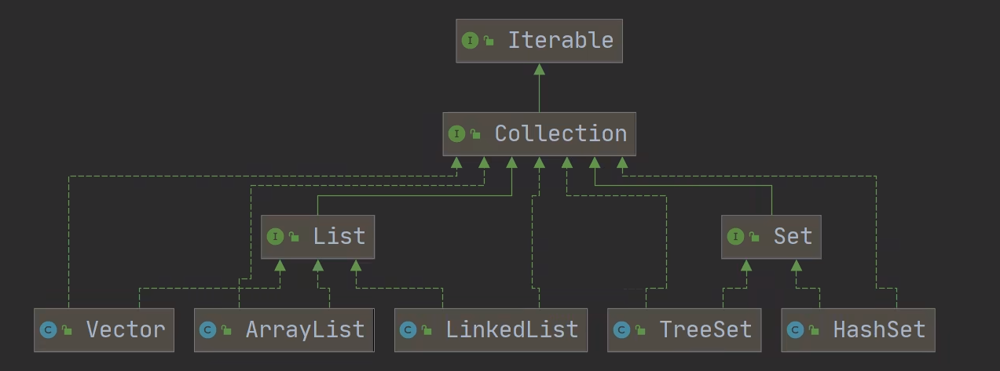
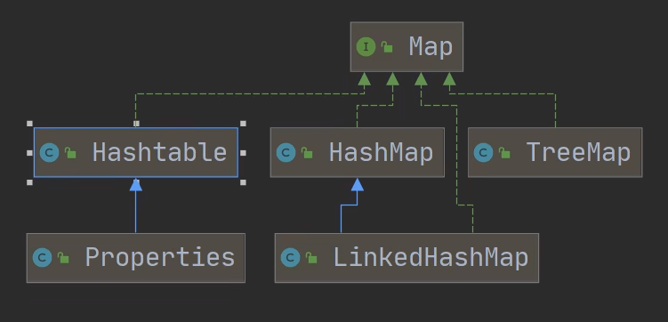
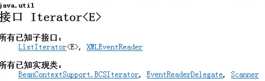
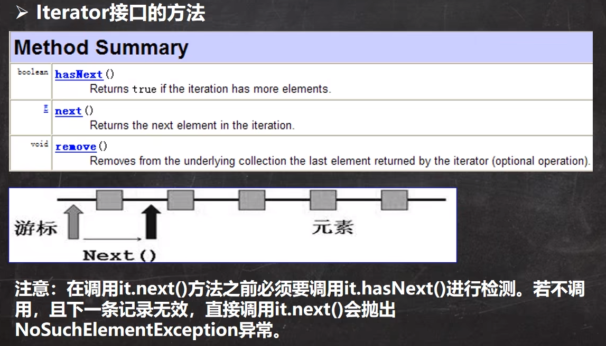
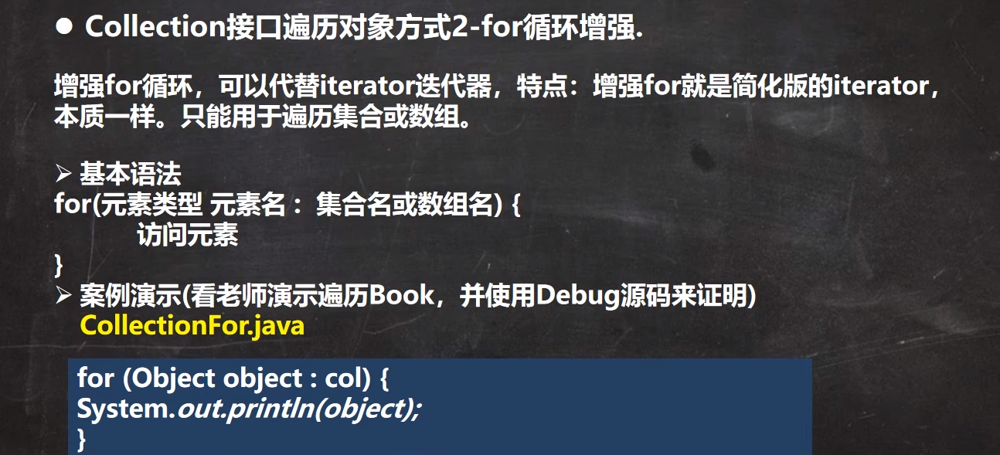
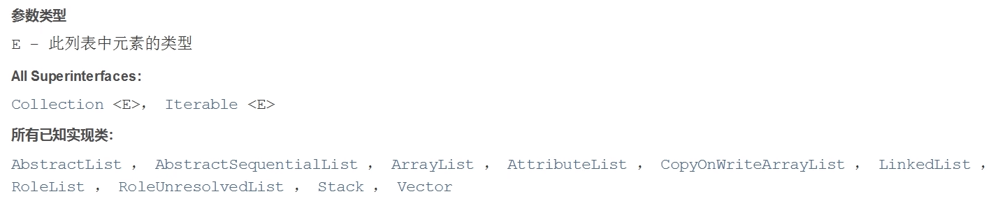
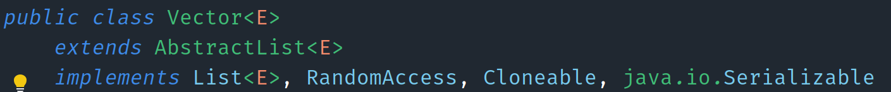
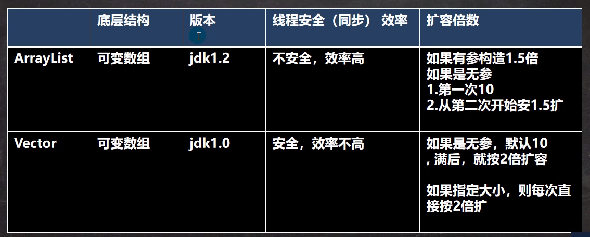
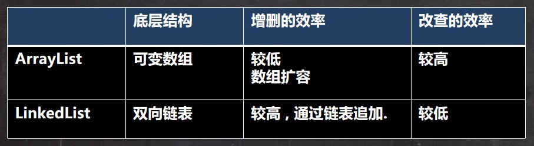

# 集合框架体系

## 集合的理解和好处

### 数组

1. 长度开始时必须指定，而且一旦指定，不能更改

2. 保存的必须为同一类型的元素

3. 使用数组进行增加元素的示意代码-比较麻烦

### 集合

1. 可以动态保存任意多个对象，使用方便

2. 提供了一系列的操作对象的方法：add、remove、set、get

3. 使用集合添加，删除新元素的示意代码

## 集合框架图

### Collection

### Map

## Collection

### Collection接口和常用方法

1. 继承自Iterable

2. collection实现子类可以存放多个元素，每个元素可以是Object

3. 有些Collection的实现类, 可以存放重复的元素，有些不可以

4. 有些Collection的实现类, 有些是有序的(List), 有些不是有序的(Set)

5. Collection接口没有直接的实现子类, 是通过它的子接口Set和List来实现的

### Collection接口遍历元素1 - 使用Iterator(迭代器)

1. Iteratro对象称为迭代器，主要用于遍历Collection集合中的元素

2. 所有实现了Collection接口的集合类都有一个iterator()方法，用以返回一个实现了Iterator接口的对象，即可以返回一个迭代器

3. Iterator的接口

4. Iterator仅用于遍历集合, Iterator本身并不存放对象

5. Iterator接口的遍历1

6. Collection遍历2

## List常用方法

### List接口基本介绍

> List接口是Collection接口的子接口

1. List集合类中元素有序(即添加顺序和取出顺序一致)、且重复

2. List集合中的每个元素都有其对应的顺序索引，即支持索引

3. List容器中的元素都对应一个整数型的序号记载其在容器中的位置，可以根据序号存取容器中的元素

4. API中的List接口的实现类是:

### ArrayList底层结构和源码分析

1. permits all elements, include null

2. ArrayList是由数组来实现数据存储的

3. ArrayList基本等同于，除了ArrayList是线程不安全的，在多线程下，不建议使用ArrayList

### ArrayList的底层机制

1. ArrayList中维护了一个Object类型的数组elementData.
   - transient Object[] elementData; // transient表示瞬间，短暂的，表示该属性不会被序列化

2. 当创建ArrayList对象时，如果使用的是无参构造器，则初始elementData容量为0.第一次添加，则扩容elementData为10,如需要再次扩容，则扩容elementData为1.5倍

3. 如果使用的是指定大小的构造器，则初始elementData容量为指定大小，如果需要扩容，则直接扩容elementData为1.5倍。

### Vector底层结构

1. Vector类的定义说明.

2. Vector底层也是一个对象数组, protected Object[] elementData;

3. Vector是线程同步的, 即线程安全, Vector类的操作方法带有synchronized.

4. 需要线程同步安全时, 考虑使用Vector.

### Vector底层机构和ArrayList的比较

### LinkedList的全面说明

1. LinkedList底层实现了双向链表和双端队列特点

2. 可以添加任意元素(元素可以重复), 包括null

3. 线程不安全，没有实现同步

### LinkedList的底层机制

1. LinkedList底层维护了一个双向链表

2. LinkedList中维护了两个属性first和last分别指向首节点和尾节点

3. 每个节点(Node对象), 里面又维护了prev、next、item三个属性，其中通过prev指向前一个，通过next指向后一个节点。最终实现双向链表

4. LinkedList的元素的添加和删除, 不是通过数组完成的。

### ArrayList和LInkedList的比较

> 如果改和查的操作多，选择ArrayList
> 如果增删的操作多，选择LinkedList

## Set

### Set介绍

1. 无序(添加和取出的顺序不一致), 没有索引

2. 不允许重复元素,所以最多包含一个null

### Set接口的常用方法

和list接口一样, Set接口也是Collection的子接口, 常用方法和Collection接口一样

### set接口的遍历方式

1. 可以使用迭代器

2. 增强for

3. 不能使用索引的方式来获取

### HashSet说明

1. HashSet实现了Set接口

2. HashSet实际是HashMap

3. 可以存放null值,但是只能有一个null(不可重复)

4. HashSet不保证元素是有序的, 取决于hash后, 再确定索引的结果

5. 不能有重复元素/对象
