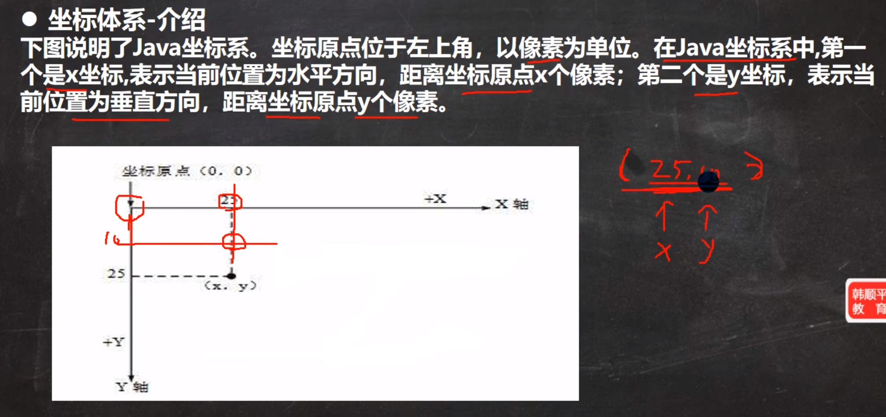
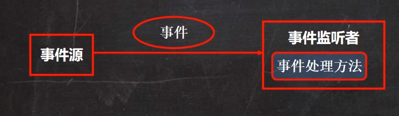

# Java绘图体系

## 坐标体系介绍

## 坐标体系-像素

> 计算机在屏幕上显示的内容都是由屏幕上的每一个像素组成的. 例如,计算机显示器的分辨率是800*600,表示计算机屏幕上的每一行由800个点组成,共有600行,整个计算机屏幕共有48000个像素,像素是一个密度单位,而厘米是一个长度单位,两者无法比较.

## 绘图原理

1. Component类提供了两个和绘图相关的方法:

   - paint(Graphics g)绘制组件的外观

   - repaint() 刷新组件的外观

2. 当组件第一次在屏幕显示的时候, 程序会自动调用paint()方法来绘制组件

   - 窗口最小化,再最大化

   - 窗口的大小发生变化

   - repaint函数被调用

# Java事件处理机制

> Java事件处理是采取"委派事件模型". 当事件发生时,产生事件的对象,会把此"信息" 传递给"事件的监听者" 处理, 这里说的"信息"实际上是java.awt.event事件类库里某个类所创建的对象,把他称为"事件的对象".

## 事件源

> 事件源是一个产生事件的对象,比如按钮,窗口等

## 事件

> 事件是承载事件源状态改变时的对象,比如键盘事件,鼠标事件,窗口事件等等,会生成一个事件对象,该对象保存着当前事件很多信息,比如keyEvent对象有含义被按下键的Code值.java.awt.event包和java.swing.event包定义了事件类型

## 事件监听器接口:

1. 当事件源产生一个事件,可以传送给事件监听者处理

2. 事件监听者实际就是一个类,该类实现了某个事件监听器接口. KeyListener接口

3. 事件监听器接口有多种,不同的事件监听器接口可以监听不同的事件,一个类可以实现多个监听接口

4. 这些接口在java.awt.event包和javax.swing.event包中定义. 列出常用的事件监听器接口,查看jdk文档聚集.
