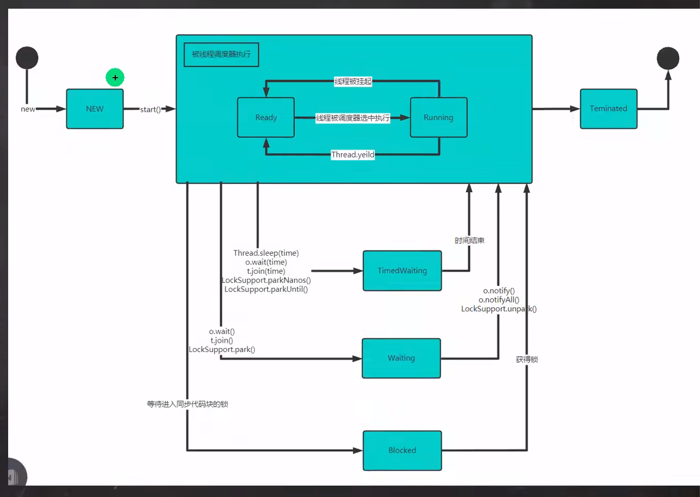

# 线程相关概念

## 程序

> 是为完成特定任务,用某种语言编写的一组指令的集合.

## 进程

1. 进程是指运行中的程序, 比如我们使用QQ,就启动了一个进程,操作系统就会为该进程分配内存空间.当使用迅雷,又启动了一个进程,操作系统会为迅雷分配新的内存空间

2. 进程是程序的一次执行过程,或是正在运行的一个程序,是动态过程:有它自身的产生,存在和消亡的过程

## 线程

1. 线程是由进程创建的,是进程的一个实体

2. 一个进程可以拥有多个线程

### 单线程和多线程

1. 单线程: 同一时刻,只允许执行一个线程

2. 多线程: 同一个时刻,可以执行多个线程,比如一个qq进程,可以同时打开多个聊天窗口,一个迅雷进程,可以同时下载多个文件

### 并发和并行

1. 并发: 同一个时刻,多个任务交替执行,造成一种同时的错觉,单核cpu实现的多任务就是并发

2. 并行: 同一个时刻,多个任务同时执行,多核cpu可以同时并行.

# 线程介绍

# 线程创建

## 创建线程的方式

1. 继承Thread类, 重写run方法

2. 实现Runnable接口, 重写run方法

   - java是单继承的,在某些情况下一个类可能已经继承了某个父类,这时在用继承Thread类方法来创建线程显然不可能了.

   - java设计者们提供了另外一个方式创建线程,就是通过实现Runnable接口来创建线程.

### 继承Thread 和实现Runnalbe的区别

1. 从底层来看,这两个本身并没有区别,都是调用native的start0这个方法

2. 但是,实现Runnable接口方式更加的适合多个线程共享一个资源的情况,并且避免了单继承的限制.

### 线程终止

1. 当线程完成任务后,会自动退出

2. 还可以通过使用变量来控制run方法退出的方式停止线程, 即通知方式

### 注意细节

1. start底层会创建新的线程,调用run,run就是一个简单的方法调用,不会启动新线程

2. 线程优先级的范围

3. interrupt,中断线程,但并没有真正的结束进程,所以一般用于中断正在休眠线程

4. sleep线程的静态方法,使当前线程休眠

# 线程方法

```java
interrupt();

yield();线程的礼让,让出cpu,让其他线程执行,但礼让的时间不确定,所以不一定礼让成功

join(); 线程的插队.插队的线程一旦插队成功,则肯定先执行完插入的线程所有的任务.
```

## 用户线程和守护线程

1. 用户线程: 也叫工作线程,当线程的任务执行完或通知方式结束

2. 守护线程: 一般是为工作线程服务的,当所有的用户线程结束,守护线程自动结束

3. 常见的守护线程: 垃圾回收机制

# 线程的生命周期


## 生命周期转换图



# Synchronized

## 线程同步机制

1. 在多线程编程, 一些敏感数据不允许被多个线程同时访问,此时就使用同步访问技术,保证数据在任何时刻,最多有一个线程访问,以保证数据的完整性

2. 线程同步,即当有一个线程在对内存进行操作时, 其他线程都不可以对这个内存地址进行操作,直到该线程完成操作,其他线程才能对该内存地址进行操作.

## 同步具体方法

1. 同步代码块

```java
synchronized (对象) {

}
```

2. synchronized还可以放在方法声明中,表示整个方法-为同步方法

```java
public synchronized void method(String name) {
}
```
## 互斥锁

1. java引入了对象互斥锁的概念,来保证共享数据操作的完整性.

2. 每个对象都对应于一个可称为"互斥锁"的标记,这个标记用来保证在任一时刻,只能有一个线程访问该对象

3. 关键字synchronized来与对象的互斥锁联系,当某个对象用synchronized修饰时,表明该对象在任一时刻只能由一个线程访问

4. 同步的局限性: 导致程序的执行效率要降低

5. 同步方法(非静态的)的锁可以是this,也可以是其他对象(要求是同一个对象)

6. 同步方法(静态的)的锁为当前类本身

### 注意事项

1. 同步方法如果没有使用static修饰: 默认锁对象为this

2. 如果方法使用static修饰,默认锁对象:当前类.class

3. 实现的落地步骤:

   - 需要先分析上锁的代码

   - 选择同步代码块或同步方法

   - 要求多个线程的锁对象为同一个即可

# 死锁

## 基本介绍

1. 多个线程都占用了对方的锁资源, 但不肯想让,导致了死锁, 在编程是一定要避免死锁的发生.

## 释放锁

1. 当前线程的同步方法,同步代码块执行结束

2. 当前线程在同步代码快,同步方法中遇到break,return

3. 当前线程在同步代码快, 同步方法出现了未处理的Error或Exception,导致异常结束案例: 没有正常的完成,不得以出来

4. 当前线程在同步代码快, 同步方法中执行了线程对象的wait()方法,当前线程暂停,并释放锁.

## 不释放锁

1. 线程执行同步代码块或同步方法时,程序调用Thread.sleep(), Thread.yield()方法暂停当前线程的执行,不会释放锁

2. 线程执行同步代码块时,其他线程调用了该线程的suspend()方法将该线程挂起,该线程不会释放锁
