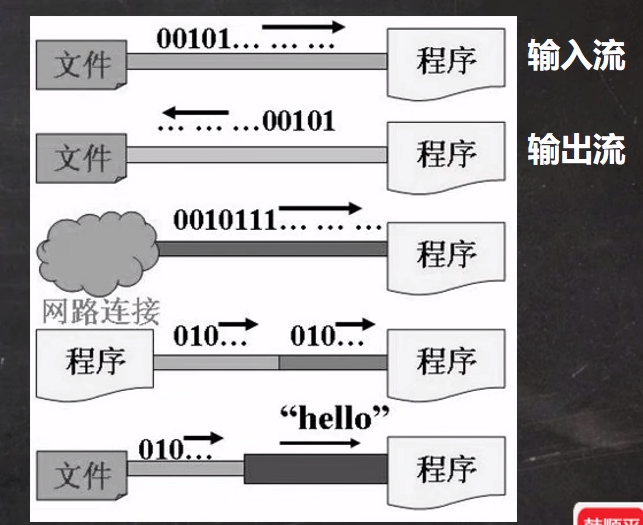
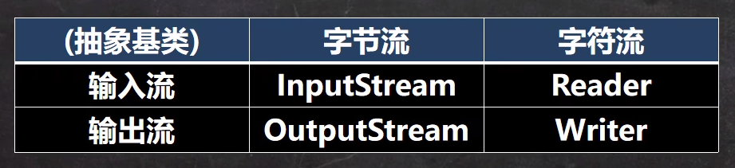

# 文件

> 文件是保存数据的地方,比如常用的word,txt,excel..都是文件,它既可以保存一张图片,也可以保持视频,声音

## 文件流

> 文件在程序中是以流的形式来操作的

### 流

> 数据在数据源(文件)和程序(内存)之间经历的路程

### 输入流

> 数据从数据源(文件)到程序(内存)的路径

### 输出流

> 数据从内存到文件的路径

# IO流原理及流的分类

## IO流原理

1. I/O是Input/Output的缩写, I/O技术是非常实用的技术,用于处理数据传输.

如 读/写文件, 网络通讯等.

2. java程序中,对于数据的输入/输出操作以"流(stream)"的方式进行.

3. java.io包下提供了各种"流"类和接口,用以获取不同种类的数据,并通过方法输入或输出数据.

4. 输入input: 读取外部数据(磁盘,光盘等存储设备的数据) 到程序(内存)中.

5. 输出output: 将程序(内存)数据输出到磁盘,光盘等存储设备中.



## 流的分类

1. 按操作数据单位不同分为: 字节流, 字符流

2. 按数据流的流向不同分为: 输入流, 输出流

3. 按流的角色的不同分为: 节点流, 处理流/包装流.



## IO流常用类

### 字节输入流

1. FileInputStream

2. BufferedInputStream

3. ObjectInputStream

### 字节输出流

### FileReader和FileWriter介绍

#### FileReader相关方法

1. new FileReader(File/String)

2. read: 每个读取单个字符, 返回该字符, 如果到文件末尾返回-1

3. read(char[]): 批量读取多个字符到数组, 返回读取到的字符数, 如果到文件末尾返回-1

### 节点流和处理流

1. 节点流可以从一个特定的数据源读写数据, 如FileReader, FileReader

2. 处理流(包装流)是连接在已存在的流之上,为程序提供更为强大的读写功能, 如BufferReader, BufferedWriter

#### 节点流和处理流的区别和联系

1. 节点流是底层流/低级流,直接跟数据源相接

2. 处理流包装节点流,既可以消除不同节点流的实现差异,也可以提供更方便的方法来完成输入输出.

3. 处理流对节点流进行包装,使用了修饰器设计模式,不会直接与数据源相连.

#### 处理流的功能体现

1. 性能的提高: 主要以增加缓冲的方式来提高输入输出的效率

2. 操作的便捷: 处理流可能提供了一系列便捷的方法来一次输入输出大批量的数据,使用更加灵活方便

```java
// 完成文本文件
BufferedWriter
BufferedReader

// 完成二进制文件
BufferedInputStream
BufferedOutputSteam
```

### 序列化

1. 序列化就是保存数据时, 保存**数据的值**和**数据类型**

2. 反序列化就是在恢复数据时, 恢复**数据的值**和**数据类型**

3. 需要让某个对象支持序列化机制, 则必须让其类是可序列化的,为了让某个类是可序列化的,该类必须实现如下两个接口之一:

   - Serializable

   - Externalizable

#### 注意事项

1. 读写顺序要一致

2. 要求实现序列化或反序列化对象,需要实现Serializable

3. 序列化的类中建议添加SerivalVersionUID,为了提高版本的兼容性

4. 序列化对象时,某人将里面所有属性都进行序列化,但除了static或**transient**修饰的成员

5. 序列化对象时, 要求里面属性的类型也需要实现序列化接口

6. 序列化具备可继承性, 也就是如果某类已经实现了序列化,则它的所有子类也已经默认实现了序列化.

### 标准输入输出流

1. System.in 标准输入流 (编译类型)InputStream (运行类型)BufferedInputStream 默认设备---键盘

2. System.out 标准输出  PrintStream(相同) 默认设备---显示器

### 转换流

1. InputStreamReader:Reader的子类, 可以将InputStream包装成Reader(字符流)

2. OutputStreamWriter:Writer的子类,实现将OutputStream(字节流)包装成Writer(字符流)

3. 当处理纯文本数据时,如果使用字符流效率更高,并且可以有效解决中文问题,所以建议将字节流转换成字符流

4. 可以使用指定编码格式

### 打印流

> 打印流只有输出流, 没有输入流
