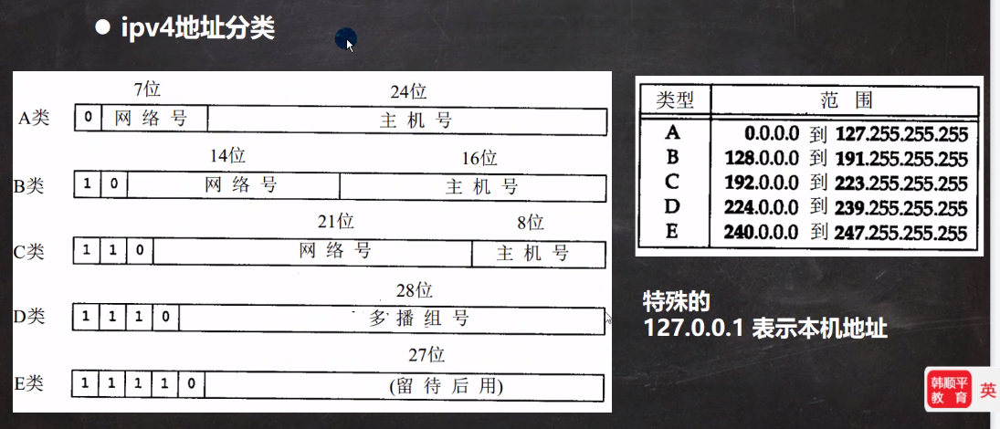

# 网络相关的概念

## 网络通信

1. 概念: 两台设备之间通过网络实现数据传输

2. 网络通信: 将数据通过网络从一台设备传输到另一台设备

3. java.net包提供了一系列的类或接口,供程序员使用,完成网络通信

## 网络

1. 概念: 两台或多台设备通过一定物理设备连起来构成了网络

2. 根据网络的覆盖范围不同,对网络进行分类:

   - 局域网: 覆盖范围最小,仅仅覆盖一个教师或一个机房

   - 城域网: 覆盖范围较大, 可以覆盖一个城市

   - 广域网: 覆盖范围最大,可以覆盖全国,甚至全球,万维网是广域网的代表

## ip地址

1. 概念: 用于唯一标识网络中的每台计算机

2. 查看ip地址: ifconfig

3. ip地址的表示形式: 点分十进制, xx.xx.xx.xx

4. 每一个十进制数的范围: 0~255

5. ip地址的组成=网络地址+主机地址, 比如 192.168.16.69

6. ipv6是互联网工程任务组设计的用于替代ipv4的下一代协议,其地址数量号称可以为全世界的每一粒沙子编上一个地址

7. ipv4最大的问题在于网络地址资源有限,严重制约了互联网的应用和发展,ipv6的使用,不仅能解决网络地址资源数量的问题,而且解决了多种结束设备连入互联网的障碍

## 域名和端口号

### 域名

1. www.baidu.com

2. 好处: 为了方便记忆,解决记ip的困难

3. 概念: 将ip地址映射成域名

### 端口号

1. 概念: 用于标识计算机上某个特定的网络程序

2. 表示形式: 以整数形式, 范围0~65535

3. 0~1024已经被占用,比如ssh 22, ftp 21, smtp 25 http 80

4. 常见网络端口号: tomcat: 8080, mysql: 3306, oracle: 1521, sqlserver: 1433

## 网络通讯协议

### 协议(tcp/ip)

> TCP/IP(Transmission Control Protocol/Internet Protocol)的简写
> 中文:传输控制协议/英特网互联协议, 又叫网络通讯协议, 这个协议是最基本的协议,Internet国际互联网的基础, 网络层的ip协议和传输层的TCP协议组成

### 网络通信协议

### TCP和UDP

#### TCP

1. 使用TCP协议前,须先建立TCP连接,形成传输数据通道

2. 传输前, 采用**三次握手**方式, 是可靠的

3. TCP协议进行通信的两个应用进程: 客户端,服务端

4. 在连接中,可以进行大数据量的传输

5. 传输完毕,需释放已建立的连接,效率低

#### UDP

1. 将数据源,源,目的封装成数据包,不需要建立连接

2. 每个数据报的大小限制在64k内, 不适合传输大量数据

3. 因无需连接,故是不可靠的

4. 发生数据结束时无需释放资源, 速度快

## InetAddress类

1. 获取本机InetAddress对象, getLocalHost

2. 根据指定主机名/域名获取ip地址对象,getByName

3. 获取InetAddress对象的主机名 getHostName

4. 获取InetAddress对象的地址 getHostAddress

## Socket

### 基本介绍

1. 套接字(Socket) 开发网络应用程序被广泛采用,以至于成为事实上的标准.

2. 通信的两端都要有Socket, 是两台机器间通信的端点

3. 网络通信其实就是Socket间的通信.

4. Socket允许程序把网络连接当成一个流,数据在两个Socket间通过IO传输

5. 一般主动发起通信的应用程序属客户端, 等待通信请求的为服务端.

### TCP网络通信编程

1. 基于客户端-服务端的网络通信

2. 底层使用的是TCP/IP协议

3. 应用场景举例: 客户端发送数据,服务端接受并显示

4. 基于Socket的TCP编程

### TCP通讯端口

> 当客户端连接到服务端后,实际上客户端也是通过一个端口和服务端进行通讯的,这个端口是TCP/IP来分配的.

## UDP网络通信编程

1. 类DatagramSocket和DatagramPacket实现了基于UDP协议网络程序

2. UDP数据包通过数据报套接字DatagramSocket发送和接收, 系统不保证UDP数据报一定能够安全送到目的地, 也不能确定什么时候可以抵达

3. DatagramPacket对象封装了UDP数据报, 在数据报中包含了发送端的IP地址和端口号以及接受端的IP地址和端口号

4. UDP协议中每个数据报都给出了完整的地址信息,因此无须建立发送方和接受方的连接
