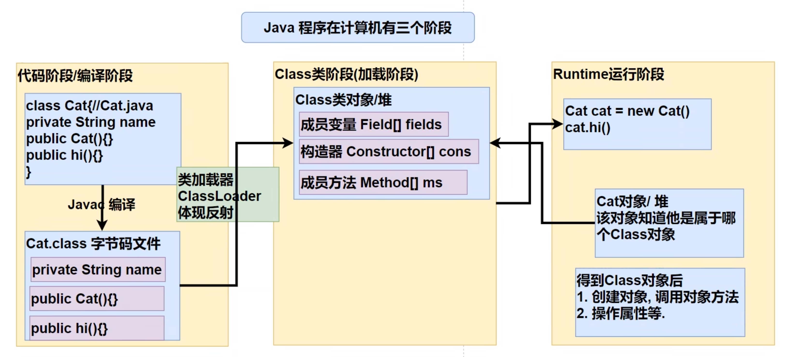
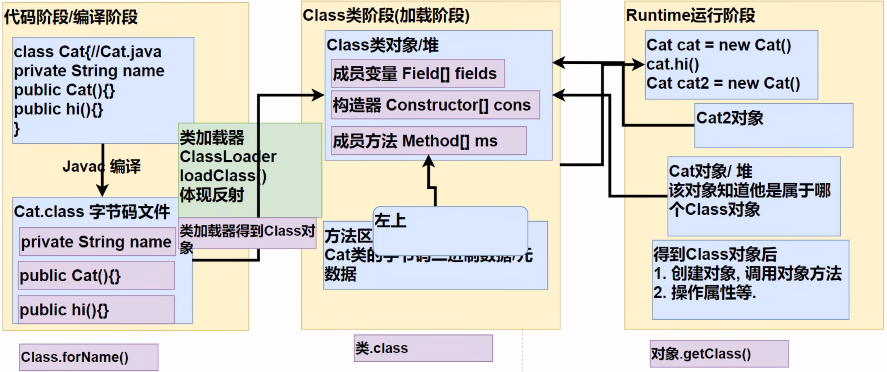
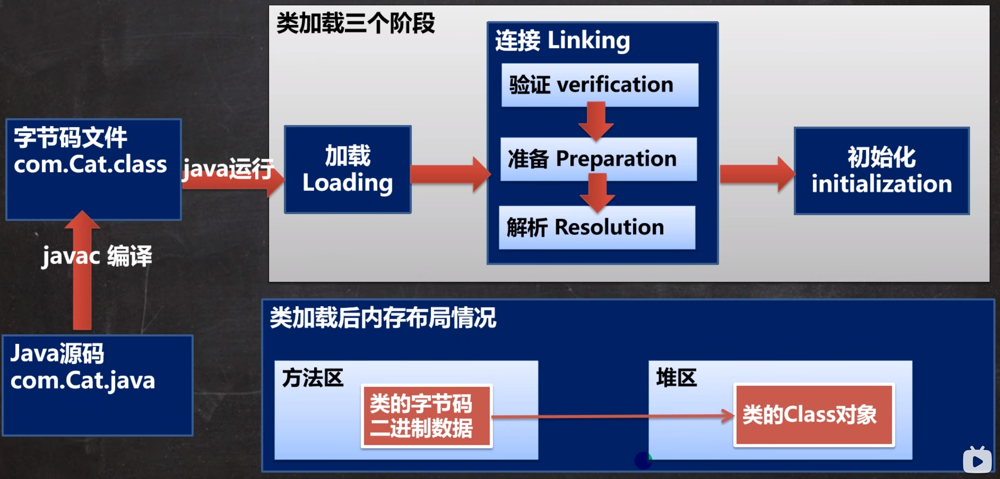

# 反射机制

## 定义

1. 反射机制允许程序在执行期借助于Reflection API取得任何类的内部信息(比如成员变量 构造器 成员方法), 并能操作对象的属性及方法. 反射在设计模式和框架底层都会用到

2. 加载完类之后,在堆中就产生了一个Class类型的对象(一个类只有一个Class对象), 这个对象包含了类的完整结构信息. 通过这个对象得到类的结构. 这个对象就像一面镜子, 通过这个镜子看到类的结构.

## 作用

1. 在运行时判断任意一个对象所属的类

2. 在运行时构造任意一个类的对象

3. 在运行时得到任意一个类所具有的成员变量和方法

4. 在运行时调用任意一个对象的成员变量和方法

5. 生成动态代理

## 主要的类

1. java.lang.Class: 代表一个类, Class对象表示某个类加载后在堆中的对象

2. java.lang.reflect.Method: 代表类的方法

3. java.lang.reflect.Field: 代表类的成员变量

4. java.lang.reflect.Constructor: 代表类的构造方法

## 优缺点

1. 优点: 可以动态的创建和使用对象(也是框架底层核心), 使用灵活, 没有反射机制,框架技术就失去底层支持

2. 缺点: 使用反射基本是解释执行,对执行速度有影响

## 反射调用优化-关闭访问检查

1. Method和Field, Constructor对象有setAccessible()方法

2. setAccessible作用是启动和禁用访问安全检查的开关

3. 参数值为true表示, 反射的对象在使用时取消访问检查,提高反射的效率, 参数值为false则表示反射的对象执行访问检查

# Class类

1. Class也是类,因此也继承Object类

2. Class类对象不是new出来的,而是系统创建的

3. 对于某个类的Class类对象,在内存中只有一份,因为类只加载一次

4. 每个类的实例都会记得自己是由那个Class实例所生成的

5. 通过Class可以完整地得到一个类的完整结构,通过一系列API

6. Class对象是存在堆的

7. 类的字节码二进制数据,是放在方法区的,有的地方称为类的元数据(包括 方法代码 变量名, 方法名, 访问权限等)

## 获取Class类对象的6种方式

1. 前提: 已知一个类的全类名,且该类在类路径下,可通过Class类的静态方法forName()获取, 可能抛出ClassNotFoundException,
   - 实例: Class cls1 = Class.forName("java.lang.Cat");
   - 应用场景: 多用于配置文件,读取类全路径,加载类

2. 前提: 若已知具体的类,通过类的class获取, 该方式最为安全可靠,程序性能最高
   - 实例: Class cls2 = Cat.class;
   - 应用场景: 多用于参数传递, 比如通过反射得到对应构造器对象

3. 前提: 已知某个类的实例, 调用该实例的getClass()方法获取Class对象,实例:
   - Class clazz = 对象.getClass();
   - 应用场景: 通过创建好的对象,获取Class对象

4. 其他方式
   - ClassLoad cl = 对象.getClass().getClassLoader();
   - Class clazz = cl.loadClass("类的全路径");

5. 基本数据
   - Class cls = int.class

6. 基本数据类型的包装类
   - Class cls = Integer.TYPE;

# 类加载

## 基本说明

> 反射机制是java实现动态语言的关键,也就是通过反射实现类动态加载

1. 静态加载: 编译时加载相关的类,如果没有则报错, 依赖性太强

2. 动态加载: 运行时加载需要的类,如果运行时不用该类,则不报错,降低了依赖性

## 类加载时机

1. 当创建对象时(new)

2. 当子类被加载时

3. 调用类中的静态成员时

4. 通过反射

## 类加载

### 加载阶段

> JVM在该阶段的主要目的是将字节码从不同的数据源转换为二进制字节流加载到内存中, 并生成一个代表该类的java.lang.Class对象

### 连接阶段

#### 连接阶段-验证

1. 目的是为了确保Class文件的字节流中包含的信息符合当前虚拟机的要求,并且不会危害虚拟机自身的安全

2. 包括: 文件格式验证(是否以魔数oxcafebabe开头), 元数据验证, 字节码验证和符号引用验证

3. 可以考虑使用-Xverify:none参数来关闭大部分的类验证措施, 缩短虚拟机类加载的时间

#### 连接阶段-准备

1. JVM会在该阶段对静态变量,分配内存并默认初始化(对应数据类型的默认初始值,如0 0L null false等). 这些变量所使用的内存都将在方法区中进行分配

#### 连接阶段-解析

1. 虚拟机将常量池内的符号引用替换为直接引用的过程

### 初始化

1. 到初始化阶段,才真正开始执行类中定义的Java程序代码,此阶段是执行<clinit>() 方法的过程

2. <clinit>() 方法是由编译器按语句在源文件中出现的顺序, 依次自动收集类中所有静态变量的赋值动作和静态代码块中的语句,并进行合并

3. 虚拟机会保证一个类的<clinit>() 方法在多线程环境中被正确地加载锁, 同步, 如果多个线程同时去初始化一个类,那么只会有一个线程去执行这个类的 <clinit>() 方法,其他线程都需要阻塞等待, 直到活动线程执行<clinit>() 方法完毕

## 反射获取类的结构信息

1. getModifiers: 以int形式返回修饰符

> 默认修饰符:0  public:1  private:2  protexted:4  static:8  final:16

# 通过反射创建对象

1. 调用类中的public修饰的无参构造器

2. 调用类中的指定构造器
