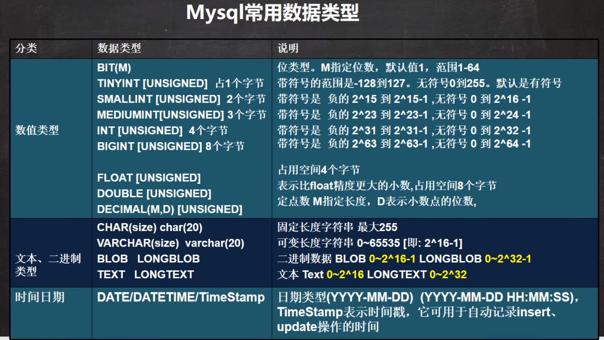
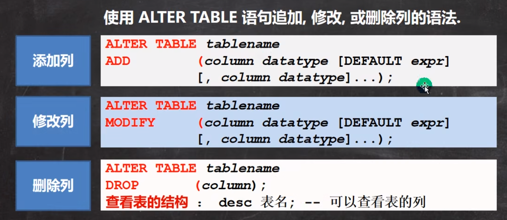
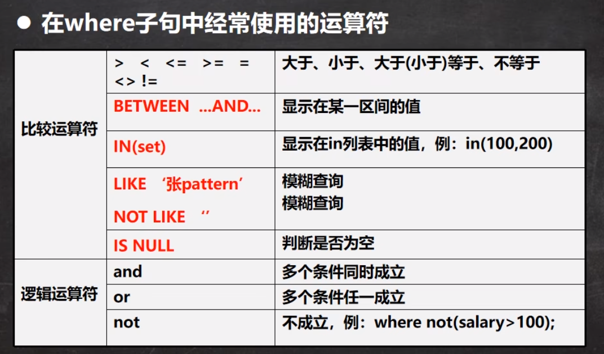

# 数据库三层架构

# SQL语句分类

1. DDL: 数据定义语句[create]

2. DML: 数据操作语句[update insert delete]

3. DQL: 数据查询语句[select]

4. DCL: 数据控制语句[管理数据库]

# 创建数据库

1. CHARACTER: 指定数据库采用的字符集. 默认utf8

2. COLLATE: 指定数据库字符集的校对规则(utf8_bin[区分大小写], utf8_general_cl[不区分大小写])

# MySQL常用数据类型



## 整数

## bit

```sql
CREATE TABLE table1 (num BIT(8));
```

## 小数型

DECIMAL[M,D] [UNSIGNED]

> M是小数位数的(精度)的总数, D是小数点(标度)后面的位数
>
> 如果D是0, 则值没有小数点或分数部分.M最大65, D最大是30, 如果d被省略, 默认是0 如果M被省略, 默认是10
>
> 建议: 如果希望小数的进度高,推荐使用decimal

```sql
CREATE TABLE table1 (num1 FLOAT,
                     num2 DOUBLE,
                     num3 DECIMAL(30, 20));
```

## 字符串

CHAR(size) 0~255

VARCHAR(size) 0~65535
可变长度字符串 最大65532字节 [utf编码最大21844字符 1-3个字节用于记录大小]

### 细节

#### 细节一

1. char(4) //4表示字符数(最大255), 不是字节数,不管是中文还是字母都是放四个,按字符计算

2. varchar(4) // 4表示字符, 不管是字母还是中文都以定义好的表的编码来存放数据

#### 细节二

char(4)是定长(固定的大小), 即使你插入'aa',也会占用分配4个字符的空间

varchar(4)是变长(变化的大小), 就是说, 如果你插入了'aa', 实际占用空间大小并不是4个字符, 而是按照实际占用空间来分配

#### 细节三

1. 什么时候用char, 什么时候使用varchar

1. 如果数据是定长, 推荐使用char, 比如md5的密码, 邮编, 手机号,身份证号等等. char(32)

2. 如果一个字段的长度是不确定,我们使用varchar, 比如留言,文章

#### 细节四

1在存放文本时, 也可以使用Text数据类型, 可以将TEXT列视为VARCHAR列, 注意Text不能有默认值, 大小0`2^16字节,如果希望存放更多字符,可以选择MEDIUMTEXT 0-2^24 或者 LOGNTEXT 0-2^32

```sql
CREATE TABLE t2 (content1 TEXT, content2 MEDIUMTEXT, content3 LONGTEXT); ```

## 日期类型

```sql
CREATE TABLE birthday6 (t1 DATE, t2 DATETIME, t3 TIMESTAMP NOT NULL DEFAULT CURRENT_TIMESTAMP ON UPDATE CURRENT_TIMESTAMP)
```

## 修改表



## insert插入细节

```sql
INSERT INTO table_name values();
```

1. 插入的数据与字段的数据类型相同

2. 数据的长度应在列的规定范围内

3. 在values中列出的数据位置必须与被加入的列的排列位置相对应

4. 字符和日期类型数据应包含在单引号中

5. 列可以插入空值[前提是该字段允许为空],

6. INSERT INTO tab_name(列名...) values (), (), () 形式添加多条记录

7. 如果是给表中的所有字段添加数据, 可以不写前面的字段名称

8. 默认值的使用, 当不给某个字段值时, 如果有默认值就会添加, 否则报错

## update更新细节

```sql
UPDATE table_name SET key=value WHERE key=value;
```

1. update语法可以用新值更新原有表行中的各列

2. set子句指示要修改那些列和要给予哪些值

3. where子句指定应更新那些行,如没有where子句,则更新所有行

4. 如果需要修改多个字段, 可以通过set字段1=值1, 字段2=值2...

## delete删除细节

```sql
DELETE FROM table_name WHERE key=value;
```

## select查询细节

### 单表

```sql
SELECT column1,column2 from table_name;
```

#### where子句中使用的运算符



#### count细节

> count(*)和count(name)当为null时,会有区别

### 多表
