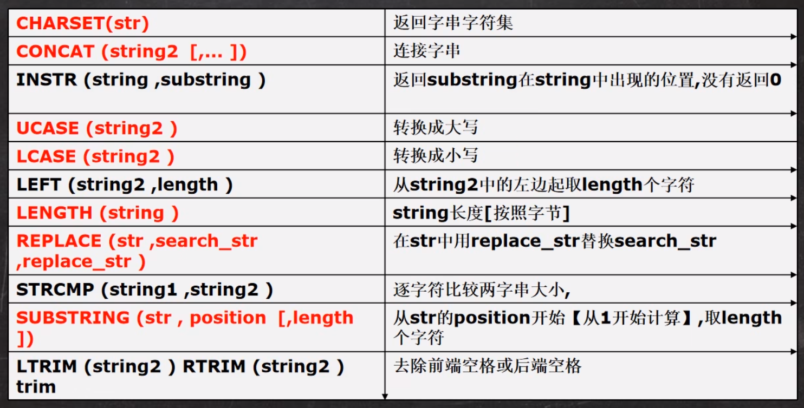
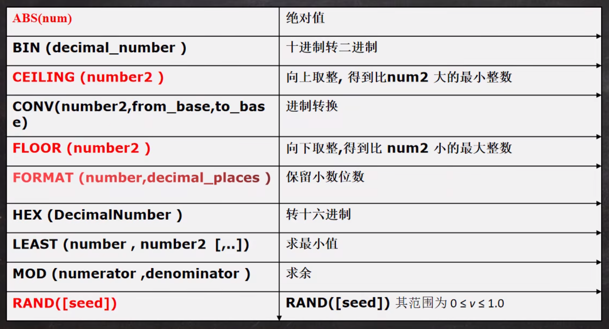
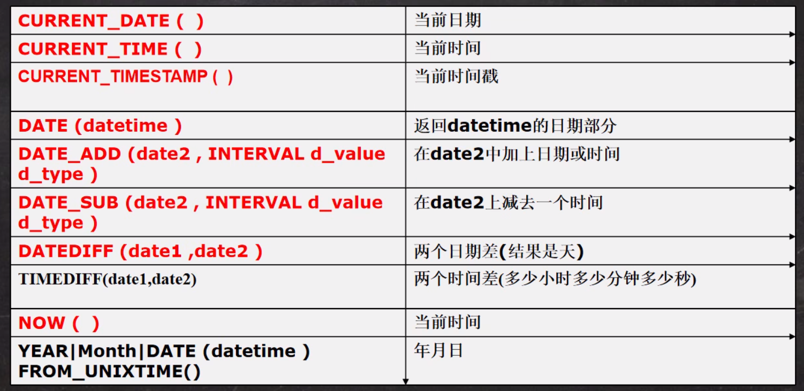
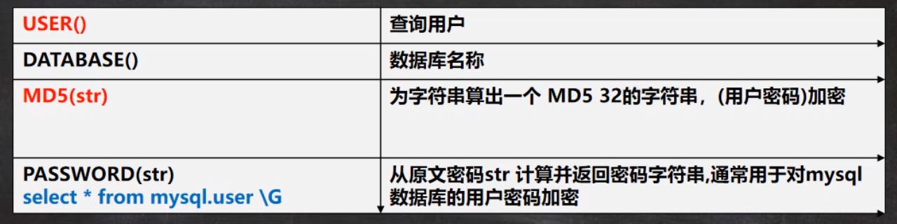
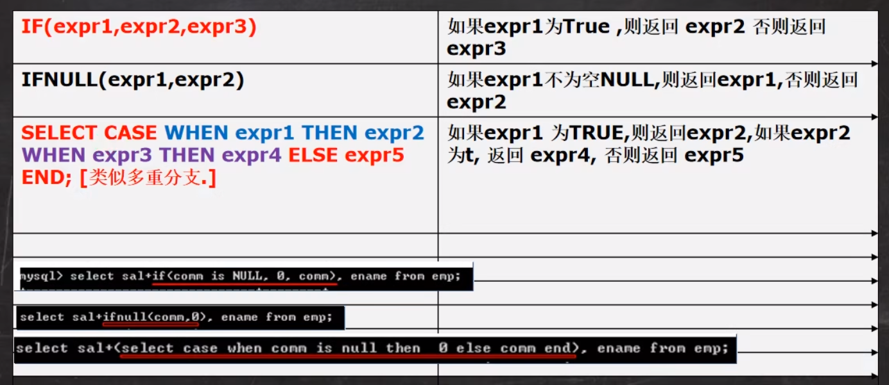
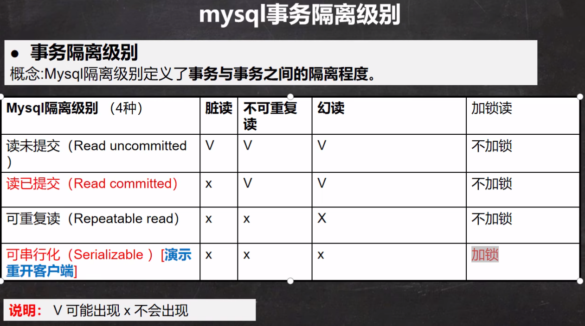

# 数据库三层架构

# SQL语句分类

1. DDL: 数据定义语句[create]

2. DML: 数据操作语句[update insert delete]

3. DQL: 数据查询语句[select]

4. DCL: 数据控制语句[管理数据库]

# 创建数据库

1. CHARACTER: 指定数据库采用的字符集. 默认utf8

2. COLLATE: 指定数据库字符集的校对规则(utf8_bin[区分大小写], utf8_general_cl[不区分大小写])

# MySQL常用数据类型


## 整数

## bit

```sql
CREATE TABLE table1 (num BIT(8));
```

## 小数型

DECIMAL[M,D] [UNSIGNED]

> M是小数位数的(精度)的总数, D是小数点(标度)后面的位数
>
> 如果D是0, 则值没有小数点或分数部分.M最大65, D最大是30, 如果d被省略, 默认是0 如果M被省略, 默认是10
>
> 建议: 如果希望小数的进度高,推荐使用decimal

```sql
CREATE TABLE table1 (num1 FLOAT,
                     num2 DOUBLE,
                     num3 DECIMAL(30, 20));
```

## 字符串

CHAR(size) 0~255

VARCHAR(size) 0~65535
可变长度字符串 最大65532字节 [utf编码最大21844字符 1-3个字节用于记录大小]

### 细节

#### 细节一

1. char(4) //4表示字符数(最大255), 不是字节数,不管是中文还是字母都是放四个,按字符计算

2. varchar(4) // 4表示字符, 不管是字母还是中文都以定义好的表的编码来存放数据

#### 细节二

char(4)是定长(固定的大小), 即使你插入'aa',也会占用分配4个字符的空间

varchar(4)是变长(变化的大小), 就是说, 如果你插入了'aa', 实际占用空间大小并不是4个字符, 而是按照实际占用空间来分配

#### 细节三

1. 什么时候用char, 什么时候使用varchar

1. 如果数据是定长, 推荐使用char, 比如md5的密码, 邮编, 手机号,身份证号等等. char(32)

2. 如果一个字段的长度是不确定,我们使用varchar, 比如留言,文章

#### 细节四

1在存放文本时, 也可以使用Text数据类型, 可以将TEXT列视为VARCHAR列, 注意Text不能有默认值, 大小0`2^16字节,如果希望存放更多字符,可以选择MEDIUMTEXT 0-2^24 或者 LOGNTEXT 0-2^32

```sql
CREATE TABLE t2 (content1 TEXT, content2 MEDIUMTEXT, content3 LONGTEXT); ```

## 日期类型

```sql
CREATE TABLE birthday6 (t1 DATE, t2 DATETIME, t3 TIMESTAMP NOT NULL DEFAULT CURRENT_TIMESTAMP ON UPDATE CURRENT_TIMESTAMP)
```

## 修改表


## insert插入细节

```sql
INSERT INTO table_name values();
```

1. 插入的数据与字段的数据类型相同

2. 数据的长度应在列的规定范围内

3. 在values中列出的数据位置必须与被加入的列的排列位置相对应

4. 字符和日期类型数据应包含在单引号中

5. 列可以插入空值[前提是该字段允许为空],

6. INSERT INTO tab_name(列名...) values (), (), () 形式添加多条记录

7. 如果是给表中的所有字段添加数据, 可以不写前面的字段名称

8. 默认值的使用, 当不给某个字段值时, 如果有默认值就会添加, 否则报错

## update更新细节

```sql
UPDATE table_name SET key=value WHERE key=value;
```

1. update语法可以用新值更新原有表行中的各列

2. set子句指示要修改那些列和要给予哪些值

3. where子句指定应更新那些行,如没有where子句,则更新所有行

4. 如果需要修改多个字段, 可以通过set字段1=值1, 字段2=值2...

## delete删除细节

```sql
DELETE FROM table_name WHERE key=value;
```

## select查询细节

### 单表

```sql
SELECT column1,column2 from table_name;
```

#### where子句中使用的运算符


#### count细节

> count(*)和count(name)当为null时,会有区别

#### group by

```sql
select deptno, avg(sal) as avgsal from emp group by deptno having avgsal < 2000;
```

#### 字符串



#### 数学相关函数



#### 时间日期相关函数



```sql
select * from mes where date_add(send_time, INTERVAL 10 MINUTES) >= now();
```

##### detail

1. DATE_ADD() 中的interval后面可以是year minute second day等

2. DATE_SUB() 中的 interval后面可以是year minute second day等

3. DATEDIFF(date1, date2)得到的是天数,而且是date1-date2的天数, 因此可以取负数

4. 这四个函数的日期类型可以是date,datetime 或者 timestamp

```sql
// return from 1970-1-1 to now ms
select unix_timestamp() from dual;

// format ms to time
select from_unixtime(unix_timestamp(), '%Y-%M-%d %H:%I:%S') from dual;
```

#### 加密和系统函数



#### 流程控制



#### 分页查询

```sql
select * from limit rows * (pages - 1), rows;
```

### 多表

#### 笛卡儿集

```sql
select ename, sal, dname, emp.deptno from emp, dept where emp.deptno = dept.deptno;
```

在默认情况下: 当两个表查询时， 规则

1. 从第一张表中, 取出一行和第二张表的每一行进行组合, 返回结果[含有两张表的所有列]

2. 一共返回的记录数从第一张表行数*第二张表的行数

3. 这样多表查询默认处理返回的结果,成为笛卡儿集

4. 解决这个表的关键就是写出正确的过滤条件where

#### 自连接

是指在同一张表的连接查询

#### 子查询

嵌入在其他sql语句中的select语句, 也叫嵌套查询

##### 单行子查询

> 返回一行数据的子查询语句

##### 多行子查询

> 返回当行数据的子查询 使用关键字in

1. 使用all操作符

```sql
select ename, sal, deptno from emp where sal > all(select sal from emp where deptno = 30);
```

2. 使用any操作符

```sql
select ename, sal, deptno from emp where sal > any(select sal from emp where deptno = 30);
```

#### 多列子查询

> 查询返回多个列数据的子查询语句

##### 表的自我复制

```sql
insert into my_tab01 select * from my_tab01;
```

##### union && union all

1. union all

> 该操作符用于取得两个结果集的并集. 当使用该操作符时, 不会取消重复行

```sql
select ename, sal, job from emp where sal> 2500 union all select ename, sal, job from emp where job='manager';
```

2. union

```sql
select ename, sal, job from emp where sal> 2500 union select ename, sal, job from emp where job='manager';
```

> 与union all相似, 但是会自动去除掉结果集中重复行

#### 外连接

##### 左外连接

```sql
select stu.id, name, grade from stu left join exam on stu.id = exam.id;
```

##### 右外连接

```sql
select stu.id, name, grade from stu right join exam on stu.id = exam.id;
```

## mysql约束

### 基本介绍

> 约束用于确保数据库的数据满足特定的商业规则. 在mysql中,约束包括: not null, unique, primary key, foreign key 和 check五种.

### primary key

> 用于唯一的标示表行的数据,当定义主键约束后, 该列不能重复

#### 细节

1. primary key 不能重复而且不能为null

2. 一张表最多只能有一个主键, 但可以是复合主键

3. 主键的指定方式有两种

   - 直接在字段名后指定: 字段名 primary key

   - 在表的定义最后写primary key(列名)

4. 使用desc表名, 可以看到primary key的情况


### not null

> 如果在列上定义了not null, 那么当插入数据时, 必须为列提供数据

### unique(唯一)

> 当定义了唯一约束后, 该列值不能重复

#### 细节

1. 如果没有指定not null, 则unique字段可以有多个null

2. 一张表可以有多个unique字段

### foreign key(外键)

> 用于定义主表和从表之间的关系: 外键约束要定义在从表上, 主表则必须具有主键约束或是unique约束, 当定义外键约束后, 要求外键列数据必须在主表的主键列存在或是null

#### 细节

1. 外键指向的表的字段, 要求是primary key 或者是unique

2. 表的类型是innodb, 这样的表才支持外键

3. 外键字段的类型要和主键字段的类型一致(长度可以不同)

4. 外键字段的值, 必须在主键字段中出现过, 或者为null[前提是外键字段允许为null]

5. 一旦建立主外键的关系, 数据不能随意删除了

### check

> 用于强制行数据之间必须满足的条件, 假定在sal列上定义了check约束, 并要求sal列值在1000~2000之间如果不再1000~2000之间就会提示出错

### 自增长

```sql
id int primary auto_increment
```

#### 细节

1. 一般来说自增长是和primary key配合使用的

2. 自增长也可以单独使用(但是需要配合一个unique)

3. 自增长修饰的字段为整数型的(虽然小数也可以但是非常非常少这样使用)

4. 自增长默认从1开始,你也可以通过如下命令修改alter table 表名 auto_increment = xxx;

5. 如果你添加数据时, 给自增长字段(列)指定的有值, 则以指定的值为准, 如果指定了自增长, 一般来说,就按照自增长的规则来添加数据

## mysql索引

### 主键索引

```sql
create table table_name (id int primary key, `name` varchar(32));

alter table table_name add primary key (id);

alter table table_name drop primary key;
```

### 唯一索引

```sql
create unique index id_index on table(id);

alter table tablename add index id_index(id);

show index from tablename;

show indexs from tablename;

show keys from tablename;

desc tablename;

drop index id_index on tablename;
```

### 普通索引

### 全文索引

### 小结

1. 较频繁的作为查询条件字段应该创建索引

2. 唯一性太差的字段不适合单独创建索引, 即使频繁作为查询条件

3. 更新非常频繁的字段不适合创建索引

4. 不会出现在where子句中字段不该创建索引

## 事务

### 事务的定义

> 事务用于保证数据的一致性, 它由一组相关的dml语句组成,该组的dml语句要么全部成功,要么全部失败.

### 事务和锁

> 当执行事务操作时(dml语句), mysql会在表上加锁, 防止其他用户改表的数据, 这对用户来讲是非常重要的

### mysql数据库控制台事务的几个重要操作

1. start transaction --开始事务

2. savepoint 保存点名 --设置保存点

3. rollback to 报错点名 --回退事务

4. rollback --回退全部事务

5. commit --提交事务, 所有的操作生效, 不能回退

### 事务的细节

1. 如果不开始事务, 默认情况下, dml操作是自动提交的, 不能回滚

2. 如果开始一个事务, 你没有创建保存点, 你可以执行rollback, 默认就是回退到你事务开始的状态

3. 你也可以在这个事务中(还没有提交时), 创建多个保存点.

4. 你可以在事务没有提交前, 选择回退到那个保存点

5. mysql的事务机制需要innodb的存储引擎才可以使用, myisam不好用

6. 开始一个事务 start transaction, set autocommit=off

### 事务的隔离级别

1. 多个连接开启各自事务操作数据库中数据时, 数据库系统要负责隔离操作, 以保证各个连接在获取数据时的准确性

2. 如果不考虑隔离性, 会引发的问题:

   - 脏读: 当一个事务读取另一个事务尚未提交的修改时, 产生脏读

   - 不可重复读: 同一查询在同一事务中多次进行, 由于其他提交事务所做的**修改或删除**,每次返回不同的结果集, 此时发生不可重复读

   - 幻读: 同一查询在同一事务中多次进行,由于其他提交事务所做的**插入**操作, 每次返回不同的结果集, 此时产生幻读



```sql
# 1. 查看当前会话隔离级别
 SELECT @@transaction_isolation;

# 2. 查看系统当前会话隔离级别
 SELECT @@global.transaction_isolation;

# 3. 设置当前会话隔离级别
set session transaction isolation level repeatable read;

# 3. 设置系统当前会话隔离级别
set global transaction isolation level repeatable read;
```

### 事务的acid特性

1. 原子性(atomicity)
> 事务是一个不可分割的工作单位,事务中的操作要么都发生,要么都不发生

2. 一致性(Consistency)
> 事务必须使数据库从一个一致性状态变换到另外一个一致性状态

3. 隔离性(isolation)
> 事务的隔离性是多个用户并发访问数据库时,数据库为每一个用户开启的事务,不能被其他事务的操作数据所干扰,多个并发事务之间要相互隔离

4. 持久性(Durability)
> 一个事务一旦被提交,它对数据库中数据的改变就是永久性的,接下来即使数据库发生故障也不应该对其有任何影响

### mysql表类型和存储引擎

1. MySQL的表类型由存储引擎(Storage Engines)决定, 主要包括MyISAM,innoDB, Memory等

2. MySQL数据表主要支持六种类型,分别是:CSV,Memory,ARCHIVE,MRG_MYISAM,MYISAM,InnoDB

3. 事务安全型: InnoDB; 其余均为第二类,非事务安全型

#### MYISAM, InnoDB, Memory

1. MYISAM不支持事务,也不支持外键,但其访问速度快,对事务完整性没有要求

2. InnoDB存储引擎提供了具有提交,回滚和崩溃恢复能力的事务安全.但是比起MyISAM存储引擎,InnoDB写的处理效率差一些并且会占用更多的磁盘空间以保留数据和索引

3. Memory存储引擎使用存在内存中的内容来创建表.每个Memory表只实际对应一个磁盘文件.Memory类型的表访问非常得快,因为它的数据是放在内存中并且默认使用HASH索引.但是一旦服务关闭,表中的数据就会丢失掉,表的结构还在.

## 视图

1. 视图是一个虚拟表,其内容由查询定义.同真实的表一样,视图包含列,其数据来自对于的真实表(基表)

### 视图的基本使用

```sql
create view viewname as select;

alter view viewname as select;

show create view viewname;

drop view viewname;
```

### 视图的细节

1. 创建视图后,到数据库去看,对于视图只有一个视图结构文件(viewname.frm)

2. 视图的数据变化会影响到基表,基表的数据变化也会影响到视图[insert update delete]

3. 视图中可以再使用视图

### 视图的最佳实践

1. 安全.一些数据表有着重要的信息.有些字段是保密的,不能让用户直接看到.这时就可以创建一个视图,在这张视图中只保留一部分字段.这样,用户就可以查询自己需要的字段,不能查看保密的字段.

2. 性能.关系数据库的数据常常会分表存储,使用外键建立这些表的之间关系.这时,数据库查询通常会用到连接(join).这样做不但麻烦,效率相对也比较低,如果建立一个视图,将相关的表和字段组合在一起,就可以避免使用join查询数据

3. 灵活.如果系统中有一张旧的表,这张表由于设计的问题,即将被废弃,然而,很多应用都是基于这张表,不易修改.这时就可以建立一张视图,视图中的数据直接映射到新建的表.这样,就可以少做很多改动,也达到了升级数据表的目的

## MySQL管理

### 用户管理

### MySQL管理细节

1. 在创建用户的时候,如果不指定Host,则为%,%表示所有IP都有连接权限---create user xxx;

2. create user 'xxx'@'192.168.1.%'表示xxx用户在192.168.1.*的ip可以登陆mysql

3. 在删除用户的时候,如果host不是%需要明确知道'用户'@'host值'
