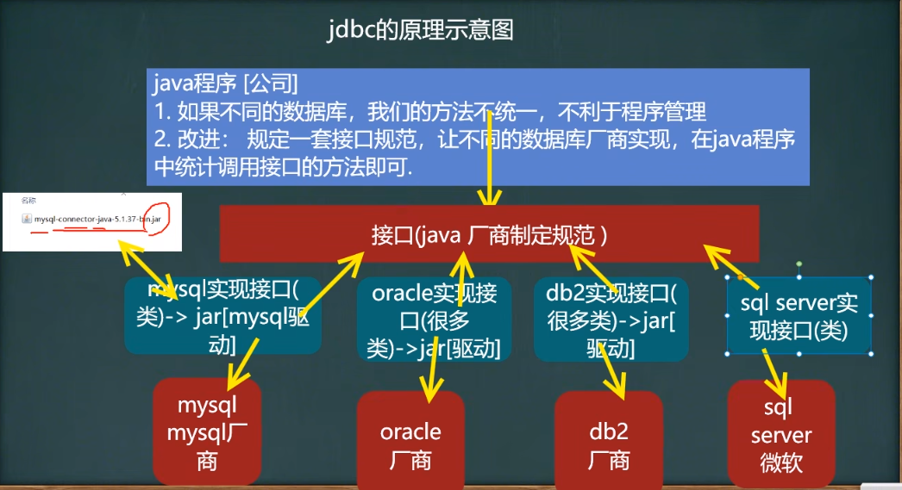
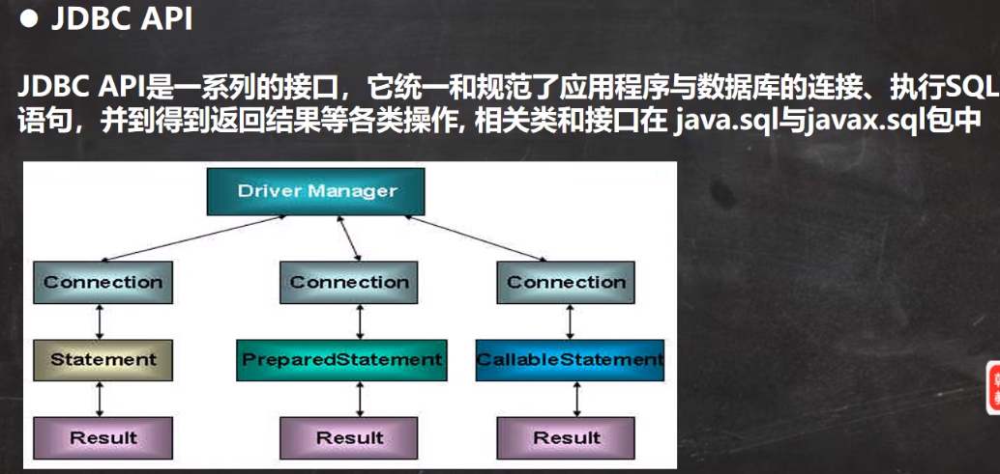

# JDBC概述

## 基本介绍

1. JDBC为访问**不同的数据库**提供了统一的接口,为使用者屏蔽了细节问题

2. Java程序员使用JDBC,可以连接任何提供了JDBC驱动程序的数据库系统,从而完成对数据库的各种操作.

3. JDBC的基本原理



# JDBC快速入门

```sql
use test01;
create table actor (
    id int primary key auto_increment,
    name varchar(32) not null default '',
    sex char(1) not null default '女',
    borndate datetime,
    phone varchar(12)
);
```


## JDBC程序编写步骤

1. 注册驱动-加载Driver类

2. 获取连接-得到Connection

3. 执行增删改查

3. 释放资源

## ResultSet结果集

1. 表示数据库结果集的数据表,通常通过执行查询数据库的语句生成

2. ResultSet对象保持一个光标指向当前的数据行, 最初,光标位于第一行之前

3. next方法将光标移动到下一行,并且由于在ResultSet对象中没有更多行时返回false,因此可以在while循环中使用循环来遍历结果集

## Statement

1. Statement对象用于执行静态SQL语句并返回其生成的结果的对象

2. 在连接建立后,需要对数据库进行访问,执行命名或是SQL语句,可以通过

   - Statement

   - PreparedStatement

   - CallableStatement

3. Statement对象执行SQL语句,存在SQL注入风险

4. SQL注入是利用某些系统没有对用户输入的数据进行充分的检查,而在用户输入数据中注入非法的SQL语句段或命令,恶意攻击数据库

5. 要防范SQL注入,只要用PreparedStatement取代Statement就可以了

## PreparedStatement

1. PreparedStatement 执行的SQL语句中的参数用问号(?)来表示，调用PreparedStatement对象的setXxx()方法来设置这些参数。setXxx()方法有两个参数，第一个参数是要设置的SQL语句中的参数的索引(从1开始)，第二个是设置SQL语句中的参数的值

2. 调用executeQuery()，返回ResultSet对象

3. 调用executeUpdate(): 执行更新，包括增、删、修改

### 预处理的好处

1. 不再使用+拼接sql语句，减少语法错误

2. 有效的解决了sql注入的问题

3. 大大减少了编译次数，效率较高

# JDBC API



## DriverManager驱动管理类

### getConnection(url, user, pwd) 获取连接

## Connection接口

### createStatement创建对象

### preparedStatement(sql)生成预处理对象

## Statement接口

### executeUpdate(sql) 执行DML语句，返回影响的行数

### executeQuery(sql)执行查询，返回ResultSet对象

### execute(sql), 返回boolean

## PreparedStatement接口

### executeUpdate()执行DML

### executeQuery()执行查询，返回ResultSet

### execute()执行任意sql，返回boolean

### setXXX(占位符索引，占位符的值)，解决SQL注入

### setObject(占位符索引，占位符的值)

## ResultSet(结果集合)

### next()

### previous()

### getXXX()

### getObject()

# JDBCUtils

# 事务

## 基本介绍

> 1. JDBC程序中当一个Conncetin对象创建时，默认情况下是自动提交事务：每次执行一个SQL语句时，如果执行成功，就会想数据库自动提交，而不能回滚
>
> 2. JDBC程序中为了让多个SQL语句作为一个整体执行，需要使用事务
>
> 3. 在调用Connection的setAutoCommit(false)可以取消自动提交事务
> 
> 4. 在所有的SQL语句都成功执行后，调用commit();方法提交事务
>
> 5. 在其中某个操作失败或出现异常时，调用rollback();方法回滚事务

# 批处理

## 基本介绍

1. 当需要成批插入或者更新记录时，可以使用Java的批量更新机制，这一机制允许许多条语句一次性提交给数据库批量处理，通常情况下比单独提交处理更有效率

2. JDBC的批量处理语句包括下面方法：

   - addBatch(): 添加需要批量处理的SQL语句或参数

   - executeBatch()：执行批量处理语句

   - clearBatch()：清空批处理包的语句

3. JDBC连接MySQL时，如果要使用批处理功能，请在url中加参数？rewriteBatchedStatements=true

4. 批处理往往和PreparedStatement一起搭配使用，可以既减少编译次数，又减少运行次数，效率大大提高

# 连接池

## 传统获取Connection问题分析

1. 传统的JDBC数据库连接使用DriverManager来获取，每次向数据库建立连接的时候都要将Connection加载到内存中，再验证IP地址，用户名和密码，需要数据库连接的时候，就向数据库要求一个，频繁的进行数据库连接操作将占用很多的系统资源，容易造成服务器崩溃。

2. 每一次数据库连接，使用完成后都得断开，如果程序出现异常而未能关闭，将导致数据库内存泄露，最终将导致重启数据库

3. 传统获取连接的方式，不能控制创建的连接数量，如连接过多，也可能导致内存泄露，MySQL崩溃

4. 解决传统开发中的数据库连接问题，可以采用数据库连接池技术

# Apache--DBUtils

# DAO增删改查-BasicDao
