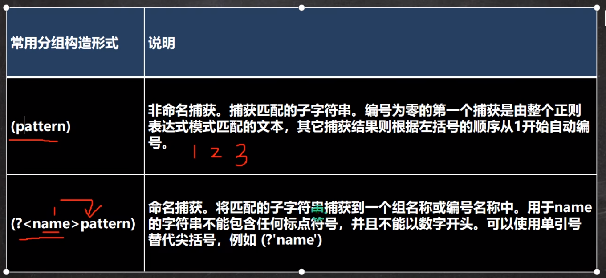
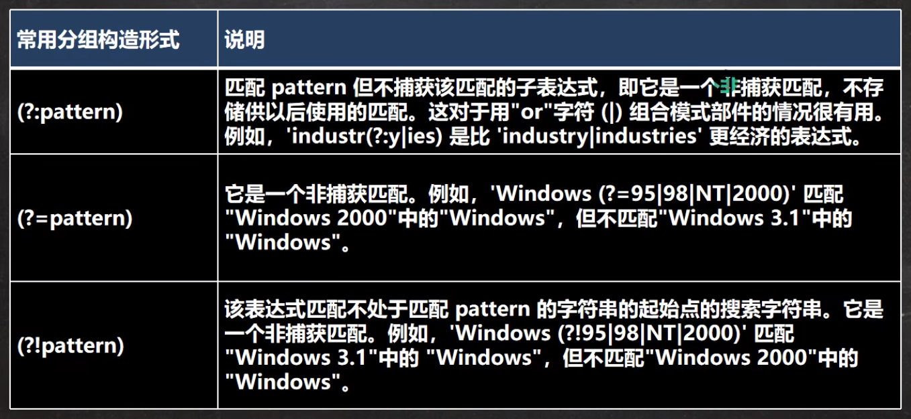

# 快速入门

## 介绍

1. 用某种模式去匹配字符串的一个公式

# 正则表达式基本语法

## 元字符-转义符\\\\

**\\\\**:在我们使用正则表达式去检索某些特殊字符的时候，需要用到转移符号，否则检索不到结果，甚至会报错

## 字符匹配符

| 符号 |       含义       |  示例  |            解释             |
| :--: | :--------------: | :----: | :-------------------------: |
|  []  | 可接受的字符列表 | [efgh] | e、f、g、h中的任意一个字符  |
| [^]  | 不接受的字符列表 | [^abc] | 除a、b、c之外的任意一个字符 |
|  -   |      连字符      |  A-Z   |      任意单个大写字母       |

| 符号  |                  含义                  |     示例     |                    解释                    |
| :---: | :------------------------------------: | :----------: | :----------------------------------------: |
|   .   |        匹配除\n以为i的任何字符         |     a..b     |                                            |
| `\\`d |     匹配单个数字字符，相当于[0-9]      | \\d{3}(\\d)? |          包含3个或4个数字的字符串          |
| `\\`D |    匹配单个数字字符，相当于[`^`0-9]    |  \\D(\\d)*   | 以单个非数字字符开头，后接任意个数字字符串 |
| `\\`w |  匹配单个数字字符，相当于[0-9a-zA-Z]   | \\d{3}\\w{4} |                                            |
| `\\`W | 匹配单个数字字符，相当于[`^`0-9a-zA-Z] |  \\W+\\d{2}  |                                            |

## 选择匹配符

在匹配某个字符串的时候是选择性的，即：既可以匹配这个，又可以匹配那个

| 符号 |           含义           | 示例 |  解释  |
| :--: | :----------------------: | :--: | :----: |
|  \|  | 匹配\|之前或之后的表达式 | a\|b | a或是b |

## 限定符

| 符号  |            含义            | 示例 | 解释 |
| :---: | :------------------------: | :--: | :--: |
|   *   |    指定字符重复0次或n次    |      |      |
|   +   |     指定字符重复1或n次     |      |      |
|  ？   |     指定字符重复0或1次     |      |      |
|  {n}  |      只能输入n个字符       |      |      |
| {n,}  |      指定至少n个匹配       |      |      |
| {n,m} | 指定至少n个但不多于m个匹配 |      |      |

## 定位符

| 符号 |          含义          |   示例    |                             解释                             |
| :--: | :--------------------: | :-------: | :----------------------------------------------------------: |
|  ^   |      指定起始字符      |           |                                                              |
|  $   |      指定结束字符      |           |                                                              |
| \\b  |  匹配目标字符串的边界  | spider\\b | 这里说的是字符串的边界指的是字串间有空格，或者是目标字符串的结束位置 |
|  \B  | 匹配目标字符串的非边界 |           |                                                              |

## 分组(捕获)

## 特别分组(非捕获)

## 反向引用

> 圆括号的内容被捕获后，可以在这个括号后被使用，从而写出一个比较实用的匹配模式，我们称之为反向引用，这种引用既可以是在正则表达式内部，也可以是在正则表达式外部，内部反向引用\\\\分组号,外部反向引用$分组号
>
> (\\d)\\1 表示两个个相同如11，22
